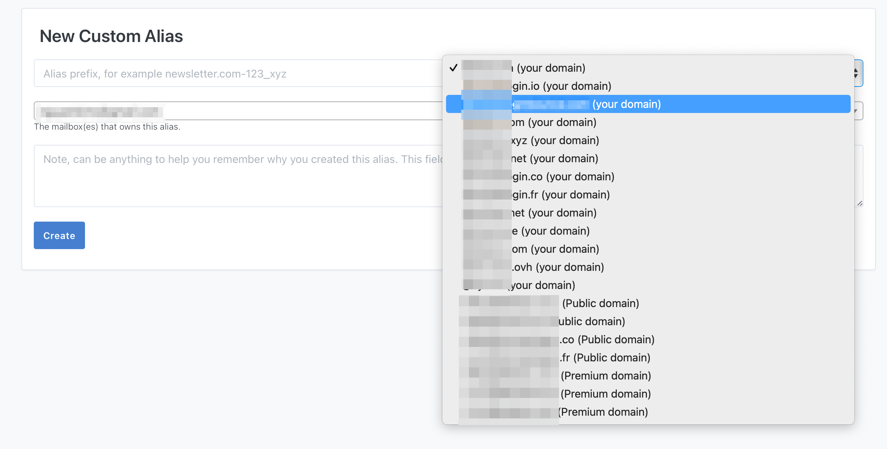
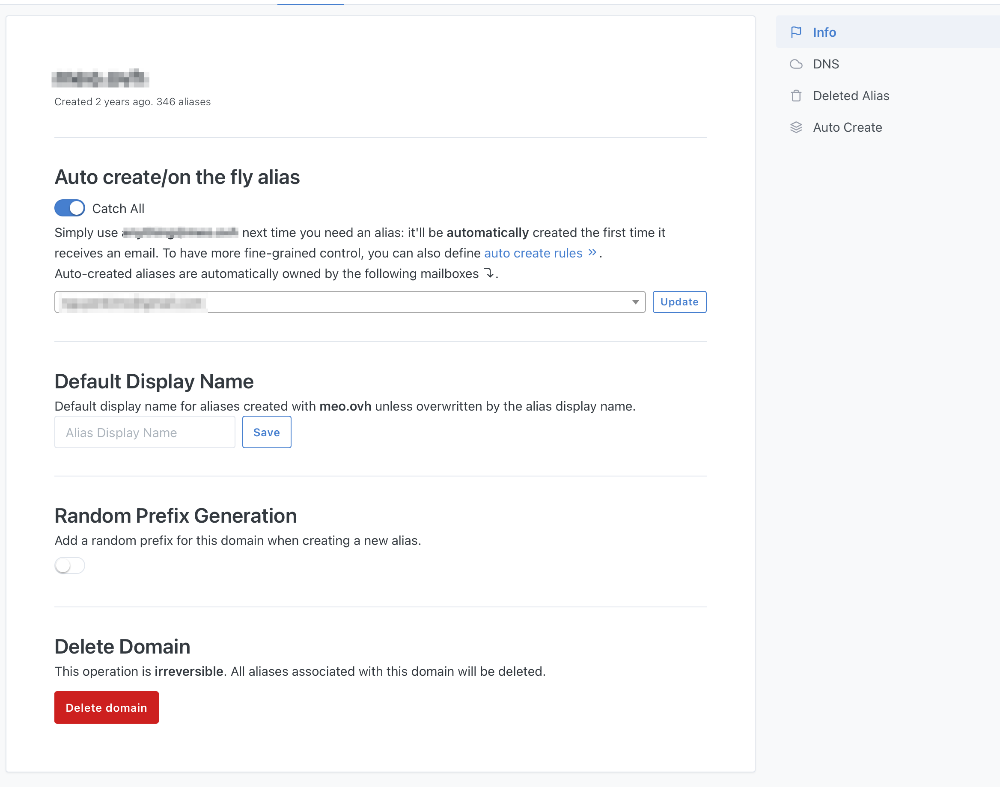

Once your domain DNS records are set up, you can then create aliases with it.

On [New Custom Alias](https://app.simplelogin.io/dashboard/custom_alias) page, you can now see your domain listed.

If you go to your domain detail page and click on "Info", you can set different options. The most useful one is probably "Catch All" that would allow you to just use anything@my-domain.com next time you need an alias: it'll be automatically created the first time it receives an email.

