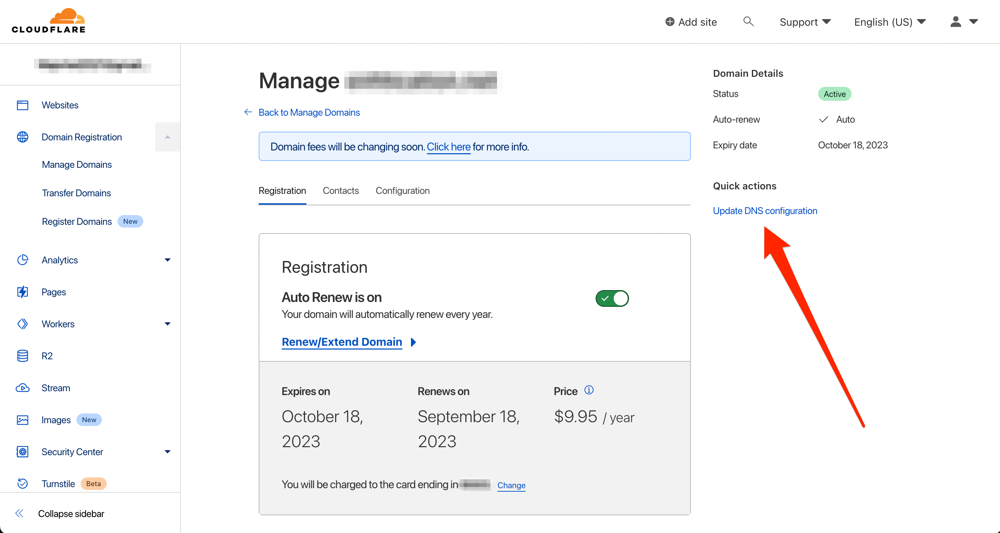
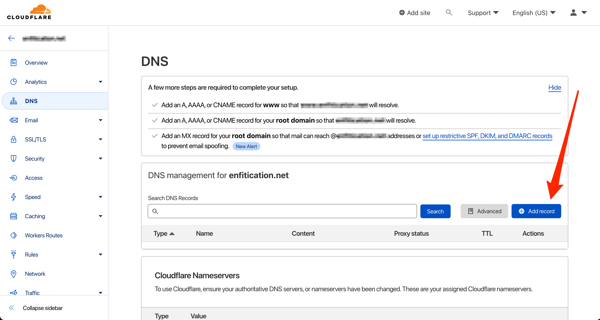
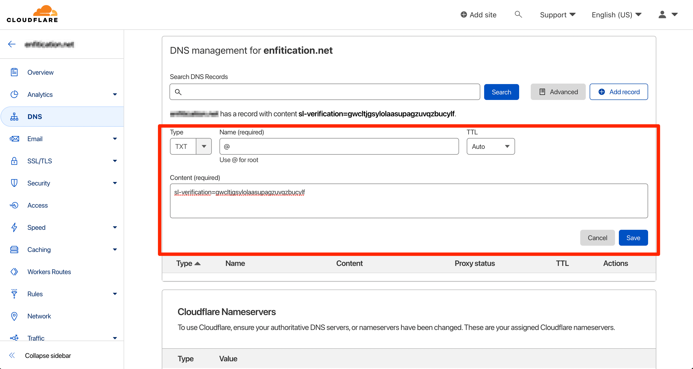
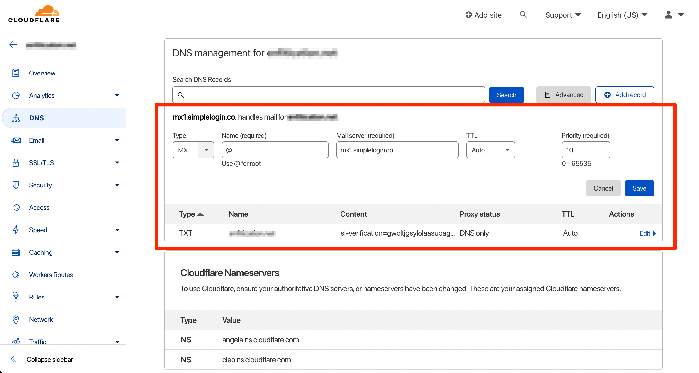
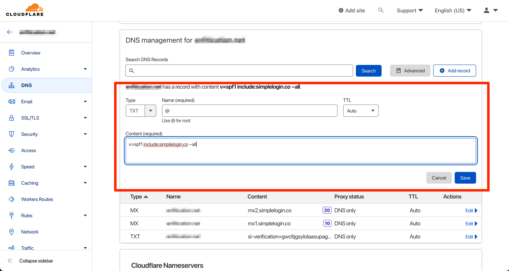
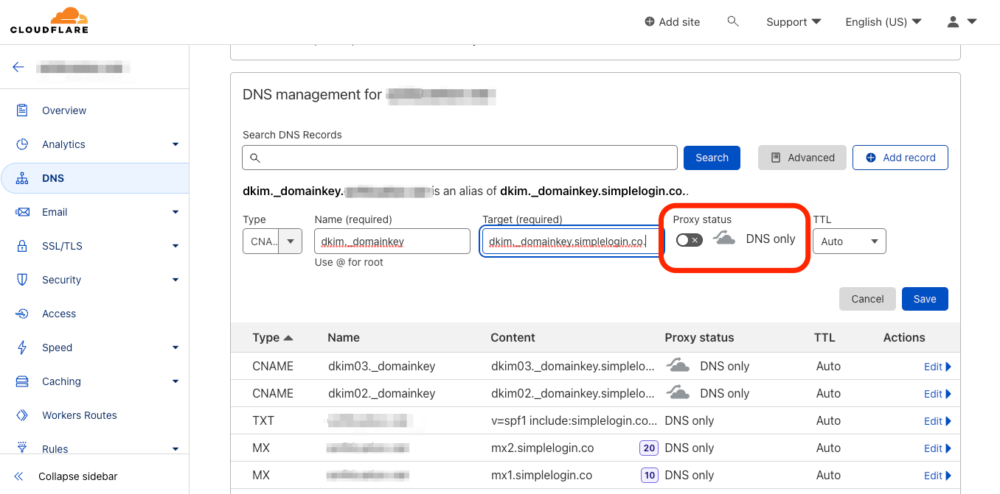
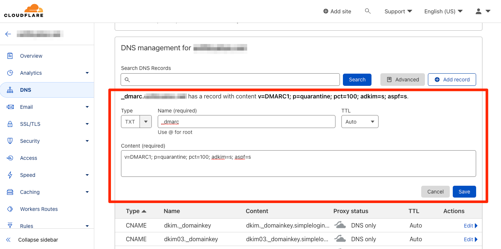

# How to add a Cloudflare domain to SimpleLogin

## **Add your domain to SimpleLogin**

Head to the SimpleLogin [domain page](https://app.simplelogin.io/dashboard/custom_domain) and add your domain:

You'll be redirected to SimpleLogin DNS page that has a guide to set up different DNS records for your domain.

## **Access the DNS configurations panel of your domain on Cloudflare**

To access the Cloudflare DNS configurations panel of your domaine click on **“Manage domains”** on the left-sidebar. 

Select the domain you would like to add to SimpleLogin and click **“Manage”.**

Once on the page of your domain, click on **“Update DNS configurations”** under “Quick actions”.

## 1. **Add TXT record on Cloudflare DNS dashboard to verify your domain ownership**

From the [Cloudflare DNS configurations panel](/docs/custom-domain/registrars/cloudflare/cloudflare/#access-the-dns-configurations-panel-of-your-domain-on-cloudflare), click on the **“Add record”**

Then create a TXT record with the data from the SimpleLogin DNS page.

- Set the record **Type** to `TXT`
- Add the value `@` under in the **Name** field
- Keep **TTL** as `Auto`
- Copy/paste the value of SimpleLogin DNS page in the **Content** field

Now click on **"Verify"** on SimpleLogin, your domain ownership should be now verified. Please note that it can take up to several minutes for the DNS change to be available. In this case don't hesitate to click on **"Verify"** several minutes later.

Once your domain ownership is verified, you can continue with the rest of the setup.

## 2. **Add MX record**

From the [Cloudflare DNS configurations panel](/docs/custom-domain/registrars/cloudflare/cloudflare/#access-the-dns-configurations-panel-of-your-domain-on-cloudflare), click on the **“Add record”** again.

**Then create a first MX record with:**

- Set the record **Type** to `MX`
- Add the value `@` under in the **Name** field
- Add the value `mx1.simplelogin.co.` under in the **Mail server** field
- Set **Priority** to `10`

**(again) Add a second MX record with:**

- Set the record **Type** to `MX`
- Add the value `@` under in the **Name** field
- Add the value `mx2.simplelogin.co.` under in the **Mail server** field
- Set **Priority** to `20`

If you have existing MX records, you need to remove them by clicking **"Edit”** and **“Delete”.**

*Here is Cloudflare’s documentation about [How to delete a DNS record on Cloudflare](https://developers.cloudflare.com/dns/manage-dns-records/how-to/create-dns-records/#delete-dns-records)*

Now click on **"Verify"** on SimpleLogin, the MX records should be now verified. As it can take up to several minutes for the DNS change to be available, don't hesitate to click on **"Verify"** several minutes later.

Once the MX record is verified, you can start creating aliases with your domain! Click on "New Custom Alias", you should now see your domain in the list of available domains.

## **(Optional) 3. Add TXT record for SPF**

Setting up SPF is recommended if you plan to send emails from your aliases. It'll reduce the chance your emails ending up in the recipient's Spam folder.

From the [Cloudflare DNS configurations panel](/docs/custom-domain/registrars/cloudflare/cloudflare/#access-the-dns-configurations-panel-of-your-domain-on-cloudflare), click on the **"Add record"** button. 

**Then add the following TXT record:**

- Set the record **Type** as `TXT`
- Add the value `@` under in the **Name** field
- Keep **TTL** as `Auto`
- Copy/paste `v=spf1 include:simplelogin.co ~all` in the **Content** field

Go back to SimpleLogin and click on **"Verify",** the SPF should be now verified.

## **(Optional) 4. Add CNAME record a Cloudflare domain for DKIM**

Similar to SPF, setting up DKIM is recommended if you plan to send emails from your aliases. It'll reduce the chance your emails ending up in the recipient's Spam folder. We will add 3 DKIM records to your DNS configuration.

From the [Cloudflare DNS configurations panel](/docs/custom-domain/registrars/cloudflare/cloudflare/#access-the-dns-configurations-panel-of-your-domain-on-cloudflare), click on the **"Add record"** button, then add the following CNAME record:

**Add a first DKIM record**

- Set the record **Type** as `CNAME`
- Add the value `dkim._domainkey` under in the **Name** field
- Add the value `dkim._domainkey.simplelogin.co.` to **Target**
- Important! **Disable the Proxy status** to `DNS only`
- Keep **TTL** as `Auto`

**(again)** **Repeat the same operation and add a second DKIM record**

- Set the record **Type** as `CNAME`
- Add the value `dkim02._domainkey` under in the **Name** field
- Add the value `dkim02._domainkey.simplelogin.co.` to **Target**
- Important! **Disable the Proxy status** to `DNS only`
- Keep **TTL** as `Auto`

**(again) Repeat the same operation and add a third DKIM record (last one, I promise)**

- Set the record **Type** as `CNAME`
- Add the value `dkim03._domainkey` under in the **Name** field
- Add the value `dkim03._domainkey.simplelogin.co.` to **Target**
- Important! **Disable the Proxy status** to `DNS only`
- Keep **TTL** as `Auto`

Go back to SimpleLogin and click on **"Verify"**, the DKIM should be now verified.

## **(Optional) 5. Add TXT record for DMARC on a Cloudflare domain**

Once you have SPF and DKIM set up, setting up DMARC is recommended to even reduce further the chance your emails ending up in the recipient's Spam folder.

From the [Cloudflare DNS configurations panel](/docs/custom-domain/registrars/cloudflare/cloudflare/#access-the-dns-configurations-panel-of-your-domain-on-cloudflare), click on the **"Add record"** button, then add the following TXT record:

- Set the record **Type** as `TXT`
- Add the value `_dmarc` under in the **Name** field
- Keep **TTL** as `Auto`
- Copy/paste the value `v=DMARC1; p=quarantine; pct=100; adkim=s; aspf=s` in the **Content** field

Go back to SimpleLogin and click on **"Verify"**, the DMARC should be now verified.

