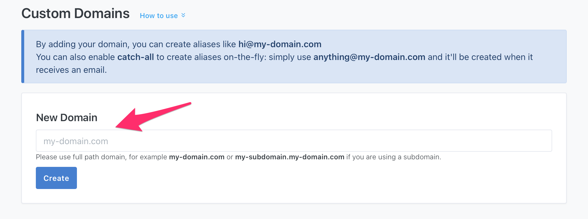
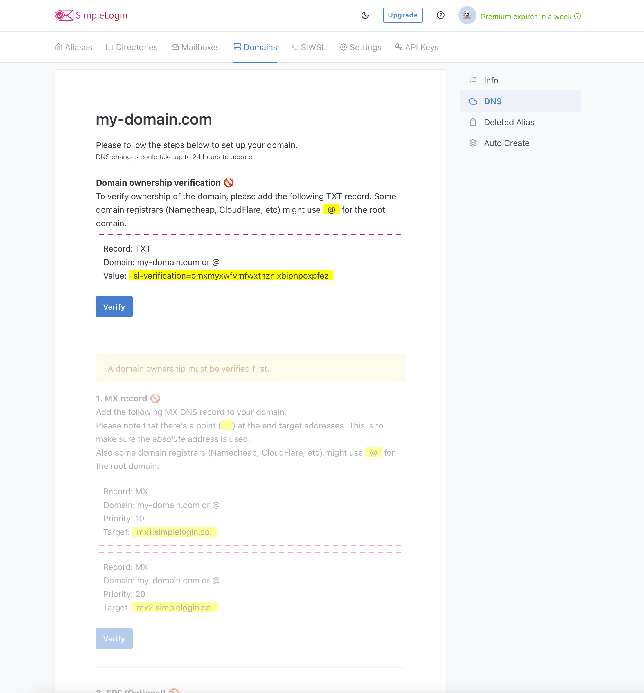
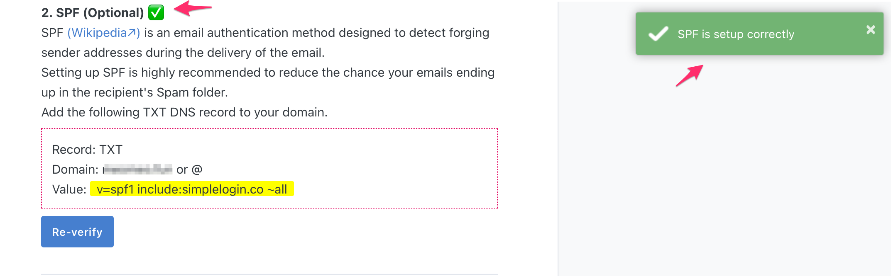
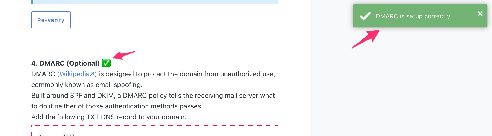

# How your Go Daddy domain to SimpleLogin

## Adding your domain to SimpleLogin

Head to the SimpleLogin [domain page](https://app.simplelogin.io/dashboard/custom_domain) and add your domain in to the field.

You'll then be redirected to the SimpleLogin DNS setup page that has a guide on how to set up different DNS records for your domain.

## Verify domain ownernership

To verify your domain ownership, press on the "Manage DNS" button under the "Domain" selection in the left sidebar on your Go Daddy dashboard.

Then create a TXT record and add the appropriate values from the SimpleLogin DNS setup screen in to the appropriate fields in Go Daddy.

Ather adding the appropriate values from the SimpleLogin DNS setup screen in to the appropriate fields in Go Daddy and waiting for it to be verified in the SimpleLogin DNS setup screen after haing pressed "Verify" in SimpleLogin. It should look something like this.

Once it looks like that, you want to go ahead and add the SimpleLogin MX records. But before you do that, you want to make sure that if you have any existing MX records in your DNS Zone, that you remove them first by pressing "Delete" button on them.

## Add MX records to go daddy

First press on "ADD" button in Go Daddy:

Then select MX in the record type:

Then add the following Values, Name, and Priorities to the MX records: 

- "Name" = @
- "Priorities" = 10 and 20 (10 for the first one 20 for the seconed mone)
- "Values" = `mx1.simplelogin.co.` and `mx2.simplelogin.co.`(mx1 bing the one you first want to add in the first MX record and mx2 being the seconed one you want to add in the seconed MX record)

Now press on "Verify" in the SimpleLogin DNS setup screen under the "MX record" selection. And wait a bit as it can take up to several minutes (or hours) before it has propagated on the web for everyone to seen, and also don't hesitate to press on "Verify" several times to see if it has propagated yet.

Once the MX records are verified, you can start creating aliases with your domain!

## (Optional) Adding Sender Policy Framework to Go Daddy

Setting up SPF (Sender Policy Framework) is highly recommended if you plan to send emails from your aliases. It'll reduce the chance of your emails ending up in a recipient's Spam Folder.

In go daddy, press the "ADD" button, then select the following record Type, Name, and Value in the record to add SPF to your domain:

- "Type" = TXT
- "Name" = @
- "Value" = `v=spf1 include:simplelogin.co ~all`

Now, after having done that, go back to the SimpleLogin DNS setup screen and press on "Verify" to see if the SPF selection has been verified or not.

If it has, it should look something like this:

If it hasn't, then double check the setup and fix any mistakes.

## (Optional) Adding DomainKeys Identified Mail to Go Daddy

Similar to SPF, setting up DKIM (DomainKeys Identified Mail) is highly recommended if you plan to send emails from your aliases.

In go daddy, press the "ADD" button, then select the following record Type, Name, and Value in the record to add DKIM to your domain:

- "Type" = CNAME
- "Name" = `dkim._domainkey`
- "Value" = `dkim._domainkey.simplelogin.co.`

Now, same as before with the spf record, go back to the SimpleLogin DNS setup screen and press on "Verify" to see if the DKIM selection has been verified or not.

If it has, it should look something like this:

If it hasn't, then double check the setup and fix any mistakes.

## (Optional) Adding Domain-based Message Authentication Reporting & Conformance to Go Daddy

Once you have set up SPF and DKIM, setting up DMARC (Domain-based Message Authentication Reporting & Conformance) is also recommended to even further reduce the chance of your emails ending up in the recipient's Spam Folder.

And again, same as before. In Go Daddy, press the "ADD" button, then select the following record Type, Name, and Value in the record to add DMARC to your domain:

- "Type" = TXT
- "Name" = `_dmarc`
- "Value" = `v=DMARC1; p=quarantine; pct=100; adkim=s; aspf=s`

And again, same as before with the spf and DKIM records, go back to the SimpleLogin DNS setup screen and press on "Verify" to see if the dmarc selection has been verified or not.

Once again, if it has, it should look something like this:

If it hasn't, then double check the setup and fix any mistakes.

# The End

Congratulations you now have offically setup simplelogin with your domain!
