# How to add your GoDaddy domain to SimpleLogin

## Adding your domain to SimpleLogin

Head to the SimpleLogin [domain page](https://app.simplelogin.io/dashboard/custom_domain) and add your domain in to the field.

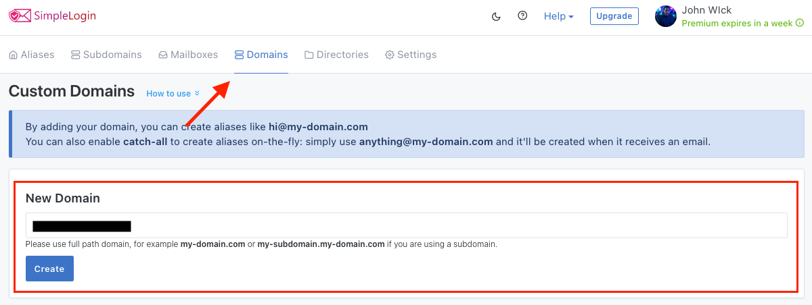

You'll then be redirected to the SimpleLogin DNS setup page that has a guide on how to set up different DNS records for your domain.

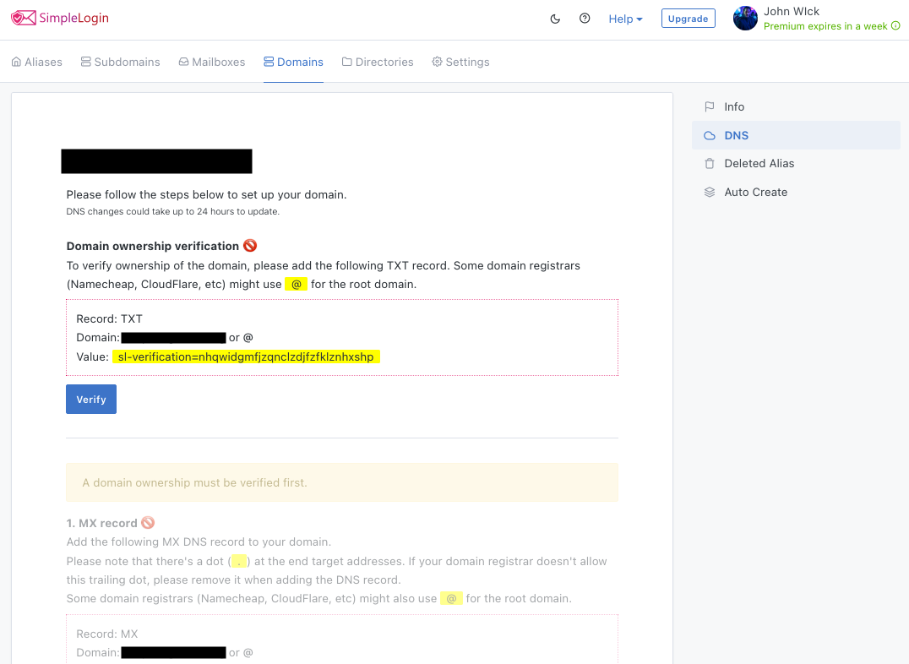

## Consider Temporarily disabling 2FV

Each of the upcoming steps will trigger 2FV verification of your identity, when 2FV is enabled on your GoDaddy account & domain. GoDaddy services will automatically disable domain DNS changes for 24 hours whenever too many authentication requests are detected in a short period of time.  Users have reported being locked out of adding DNS records after having quickly completed the steps or mistyping the 2FV password. Consider disabling 2FV before continueing with the subsequent steps.  The sub sections below will wealk you through disabling 2FV temporarily. 

### Open User Menu Account Settings

From any page within the godaddy customer portal you can find the Account Settings link by clicking the user initial chip in the top-right corner of the page.  The user menu will then appear and display a link to the Account Settings page.

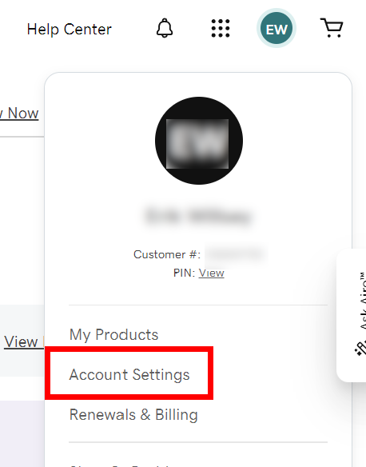

### Open Login and Pin Settings

After the Account Settings page has loaded, click the Account Settinsg button in the top-left tab header araea.  The menu that pops will display a link titled *Login & Pin".  Click that link.

### Editing 2fV

The Login & Pin page has two columns within which settings are grouped by feature. The 2FV feature is in the right column and is the second feature from the top.  Locate it and   Locate the 2FV feature section and click the Edit link.

### Remove Authentication Service(s)

First note down somewhere the authentication service name and unique ID.  You'll need that information at end of this process in order to re-enable 2FV.  Next click the delete link in the right-most column of the services list.  

You will then be prompted to confirm the removal.  Click Remove to complete the process for that authenitcation service.

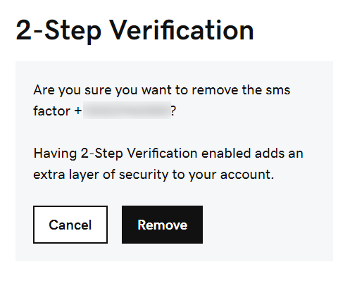

Repeat the previous two steps for each of the remaining services.  If no services exist you can move on to the next step below.  

## Verify domain ownership

To verify ownership of your domain, press on the "Manage DNS" button under the "Domain" selection in the left sidebar in your GoDaddy dashboard.

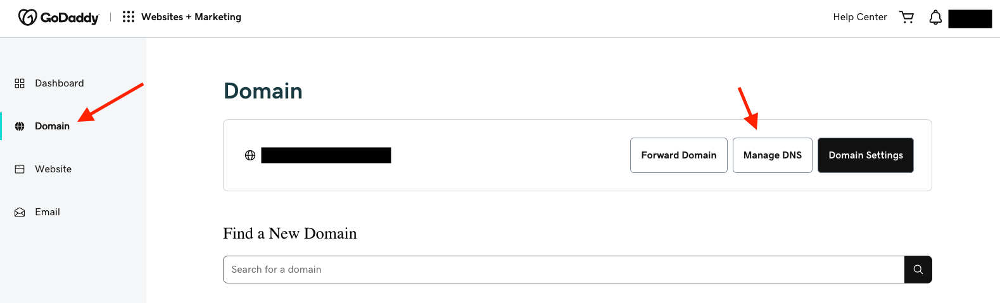

Then create a TXT record and add the appropriate values from the SimpleLogin DNS setup page in to the appropriate fields in GoDaddy.

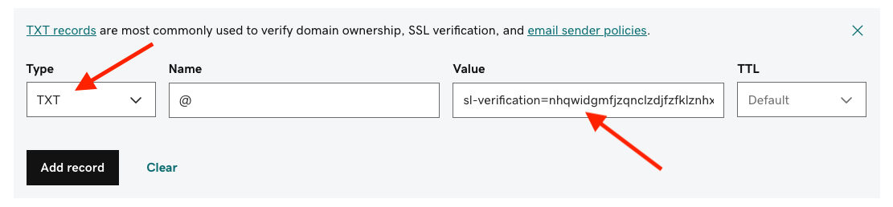

After adding the appropriate values from the SimpleLogin DNS setup page in to the appropriate fields in GoDaddy and waiting for it to be verified in the SimpleLogin DNS setup page after having pressed "Verify" in SimpleLogin. It should look something like this.

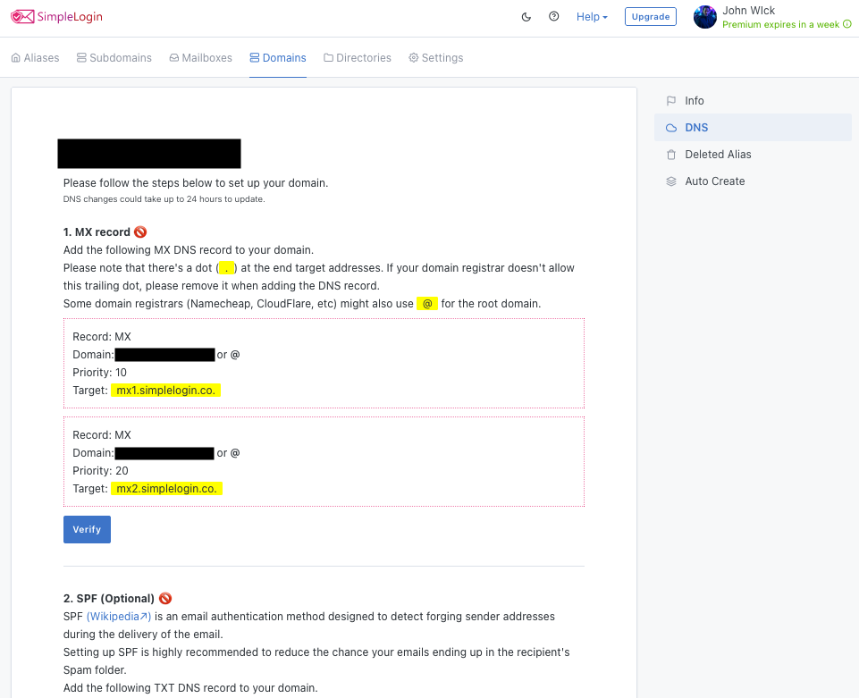

Once it looks like that, you want to go ahead and add the SimpleLogin MX records. But before you do that, you want to make sure that if you have any existing MX records in your DNS Zone, that you remove them first by pressing the "Delete" button on them.

## Add MX records to GoDaddy

First press on the "ADD" button in GoDaddy:

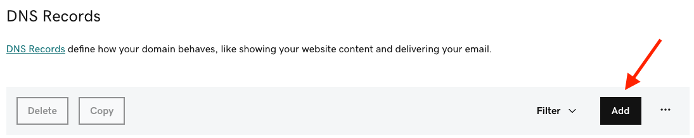

Then select MX in the record type(s):

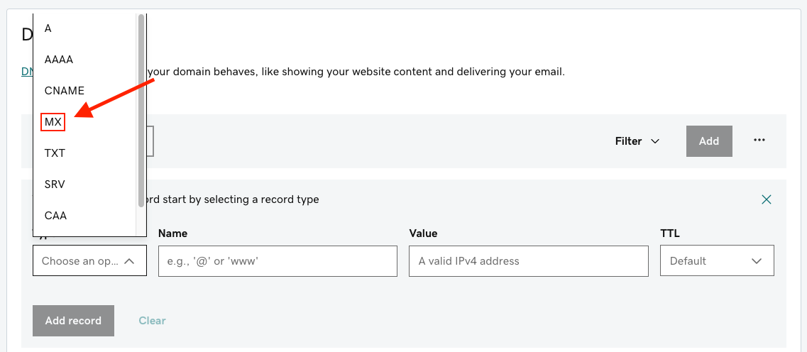

Then add the following Values, Name, and Priorities to the MX records: 

- "Name" = @
- "Priorities" = 10 and 20 (10 for the first one and 20 for the second one)
- "Values" = `mx1.simplelogin.co.` and `mx2.simplelogin.co.`(mx1 being the one you first want to add in the first MX record and mx2 being the second one you want to add in the second MX record)

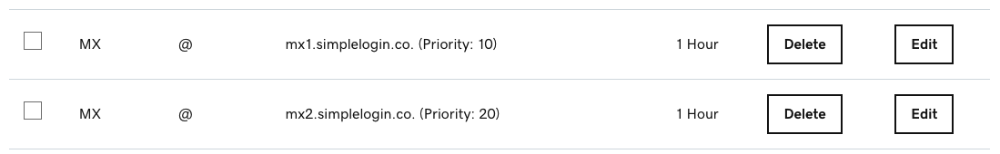

Now press on "Verify" in the SimpleLogin DNS setup page under the "MX record" selection. And wait a bit as it can take up to several minutes (or hours) before it has propagated correctly on the web for everyone to seen, and also don't hesitate to press on "Verify" several times to see if it has propagated yet.

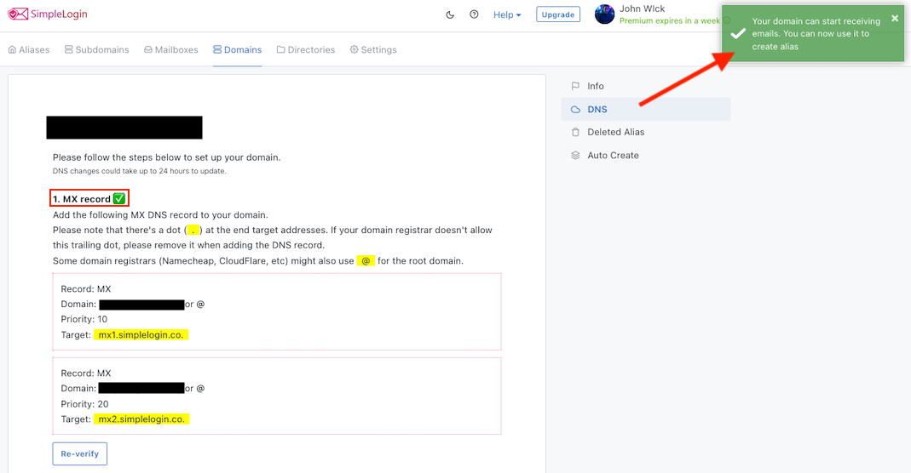

Once the MX records are verified, you can start creating aliases with your domain!

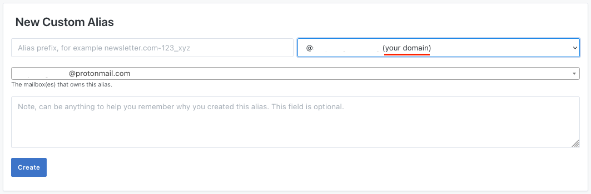

## (Optional) Adding Sender Policy Framework to GoDaddy

Setting up a SPF (Sender Policy Framework) policy for your domain is highly recommended if you plan to send emails from your aliases. It'll reduce the chance of your emails ending up in a recipient's spam folder.

In GoDaddy, press the "ADD" button, then select the following record Type, Name, and Value in the record to add a SPF policy to your domain:

- "Type" = TXT
- "Name" = @
- "Value" = `v=spf1 include:simplelogin.co ~all`

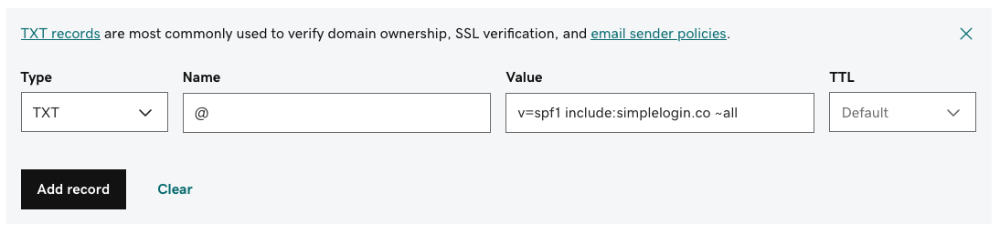

Now, after having done that, go back to the SimpleLogin DNS setup page and press on "Verify" to see if the SPF selection has been verified yet or not.

If it has, it should look something like this:

If it hasn't, then double check the setup and fix any mistakes.

## (Optional) Adding DomainKeys Identified Mail to GoDaddy

Similar to SPF, setting up a DKIM (DomainKeys Identified Mail) policy for your domain is highly recommended if you plan to send emails from your aliases.

In GoDaddy, press the "ADD" button, then select the following record Types, Names, and Values and add them into three different records to add DKIM to your domain:

(Please note that as of recent changes the DKIM setup process has gotten more keys added to too it making the total amount of records three instead of one)

- "Type" = CNAME
- "Name" = `dkim._domainkey`
- "Value" = `dkim._domainkey.simplelogin.co.`

- "Type" = CNAME
- "Name" = `dkim02._domainkey`
- "Value" = `dkim02._domainkey.simplelogin.co.`

- "Type" = CNAME
- "Name" = `dkim03._domainkey`
- "Value" = `dkim03._domainkey.simplelogin.co.`

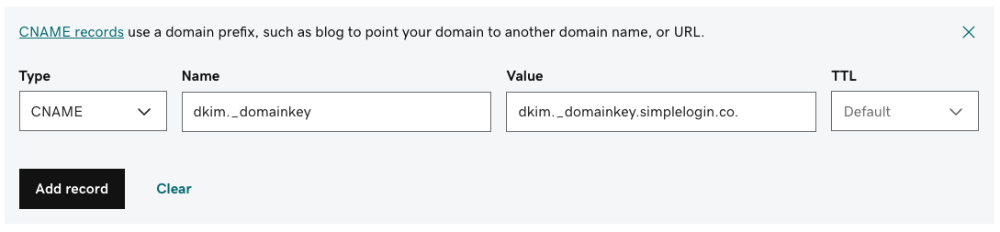

Now, same as before with the SPF policy, go back to the SimpleLogin DNS setup page and press on "Verify" to see if the DKIM selection has been verified or not.

If it has, it should look something like this:

If it hasn't, then double check the setup and fix any mistakes.

## (Optional) Adding Domain-based Message Authentication Reporting & Conformance to GoDaddy

Once you have set up the SPF and DKIM policies for your domain, setting up a DMARC (Domain-based Message Authentication Reporting & Conformance) policy next is also recommended to even further reduce the chance of your emails ending up in the recipient's spam folder.

And again, same as before. In GoDaddy, press the "ADD" button, then select the following record Type, Name, and Value in the record to add the DMARC policy to your domain:

- "Type" = TXT
- "Name" = `_dmarc`
- "Value" = `v=DMARC1; p=quarantine; pct=100; adkim=s; aspf=s`

And again, same as before with the SPF and DKIM policies, go back to the SimpleLogin DNS setup page and press on "Verify" to see if the DMARC selection has been verified or not.

Once again, if it has, it should look something like this:

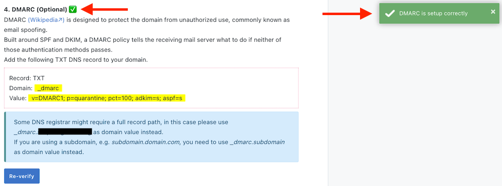

If it hasn't, then double check the setup and fix any mistakes.

## Re-enable 2FV if previously disabled

If you elected to disable 2FV near the start of these steps, you'll want to repeat the previous steps but this time re-add the previoulsy removed authentication services. 

### (Optional) Open User Menu Account Settings

Click the user chip in the top-right corner of the page.  Click the Account Settings link located in the user menu which appears.  

### (Optional) Open Login and Pin Settings

After the Account Settings page has loaded click the Account Settinsg button in the top-left tab header araea.  The menu that pops will include a link titled *Login & Pin".  Click that link.

### (Optional) Add Backup

Locate the 2FV card in the right-column of the **Login & Pin** page.  At the bottom of the card there is a button labeled **Add Backup**.  Click that button to be able to select which authentication service will deliver the backup authorization.  

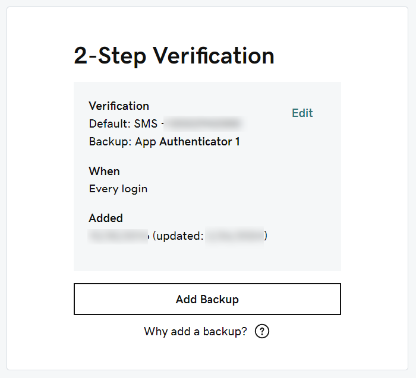

### Select Backup Verification Service

Select the verification service from the list provided and click **Next**. 

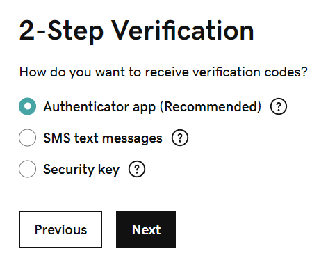

The next set of instructions will vary by service.  If you select the **Authenticator app** you will have to walk through the installation/deployment of an app on your mobile device.  If you select **SMS** you'll need to enter the phone number and verify it.  If you select **Security Key** you'll then walk through the detection and configuration of the key.  

Repeat the previous two steps for each of the remaining services to be restored.

# The End

Congratulations! You now have offically setup SimpleLogin to work with your own domain!
