# How to add a Google domain to SimpleLogin. 

## Add your domain to SimpleLogin 

Head to the SimpleLogin [domain page](https://app.simplelogin.io/dashboard/custom_domain) and add your domain:

You'll be redirected to SimpleLogin DNS page that has a guide to set up different DNS records for your domain.

## Add TXT record on Google Domains dashboard to verify your domain ownernership

To verify your domain ownership, click on the "DNS" button on the left sidebar on your Google Domains dashboard:

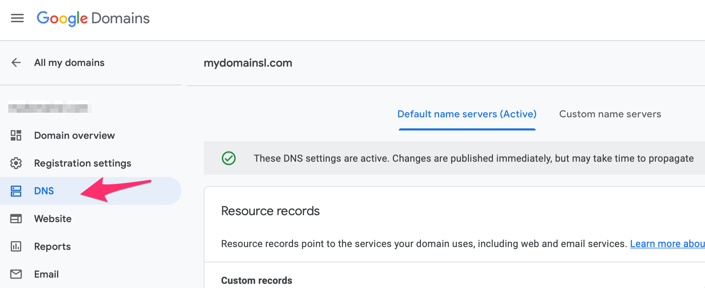

Then create a TXT record with "data" being the value on SimpleLogin dashboard.

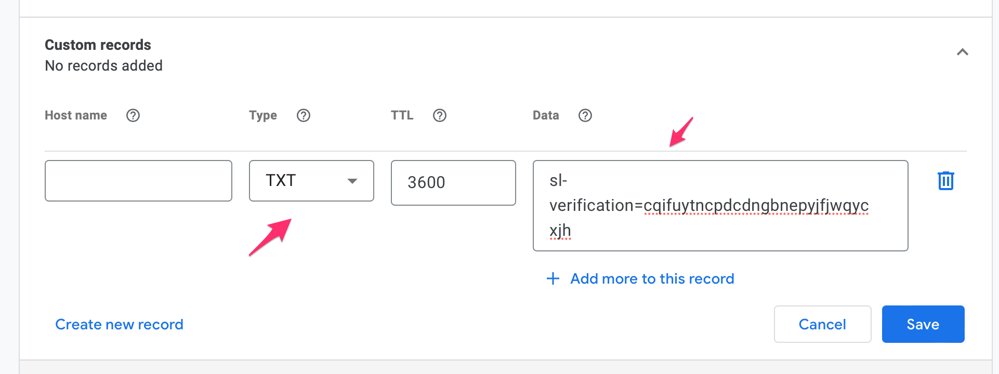

Leave the "Host name" empty and put the value required by SimpleLogin on the "Data" field. Don't forget to click on "Save" to save the change.

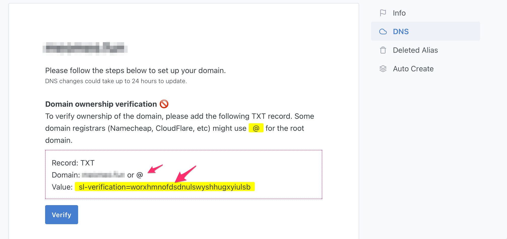

Now click on "Verify" on SimpleLogin, your domain ownership should be now verified. Please note that it can take up to several minutes for the DNS change to be available. In this case don't hesitate to click on "Verify" several minutes later.

Once your domain ownership is verified, you can continue with the rest of the setup.

## Add MX record on Google Domains

First click on "Manage Custom Record":

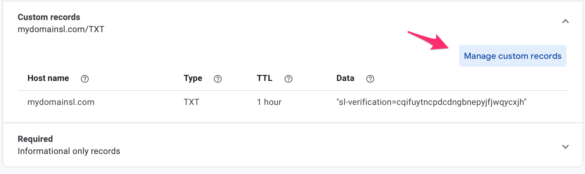

then click on "Create new record":

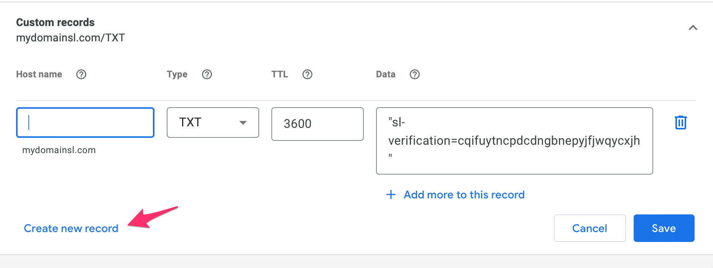

Then create a MX record with: 

- "Host name" being empty
- "Type" being "MX"
- Use the "Add more to this record" to create 2 rows for the value: the first row is `10 mx1.simplelogin.co.` and the second one is `20 mx2.simplelogin.co.`

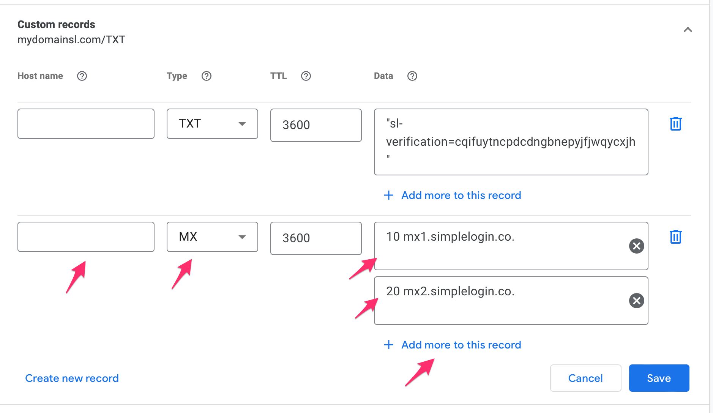

If you have existing MX records, you need to remove them by clicking on the "trash" icon.

Now click on "Verify" on SimpleLogin, the MX records should be now verified. As it can take up to several minutes for the DNS change to be available, don't hesitate to click on "Verify" several minutes later.

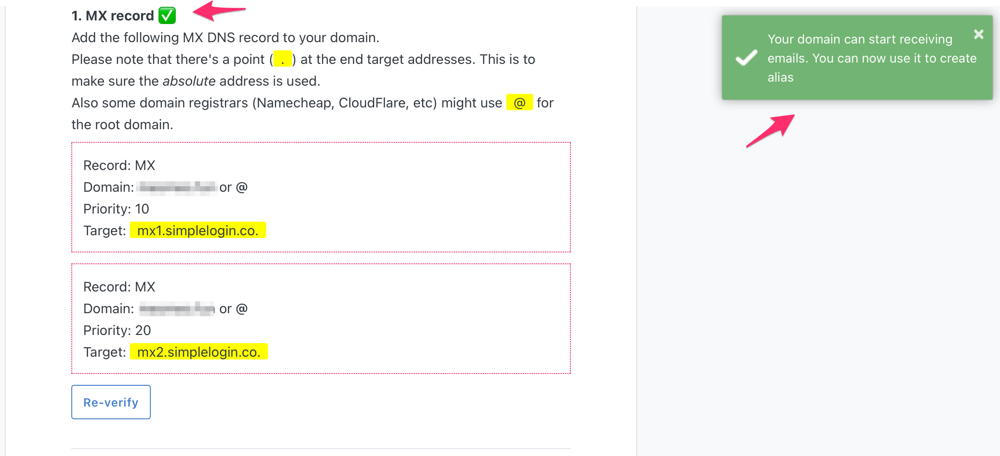

Once the MX record is verified, you can start creating aliases with your domain! Click on "New Custom Alias", you should now see your domain in the list of available domains.

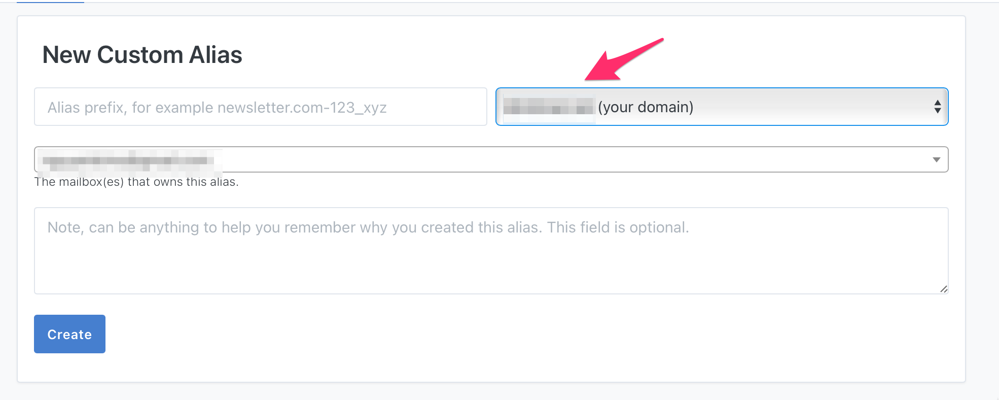

## (Optional) Add TXT record on Google Domains for SPF

Setting up SPF is recommended if you plan to send emails from your aliases. It'll reduce the chance your emails ending up in the recipient's Spam folder.

On Google Domains, click on "Create new record" button, then add the following TXT record:

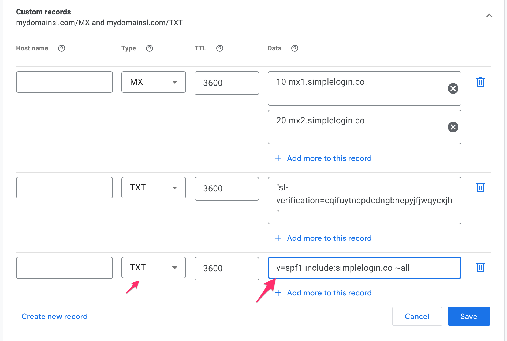

Leave the "Host name" empty and use `v=spf1 include:simplelogin.co ~all` as "Data".

Go back to SimpleLogin and click on "Verify", the SPF should be now verified.

## (Optional) Add CNAME record on Google Domains for DKIM

Similar to SPF, setting up DKIM is recommended if you plan to send emails from your aliases. It'll reduce the chance your emails ending up in the recipient's Spam folder.

On Google Domains, click on "Create new record" button, then add the following CNAME record:

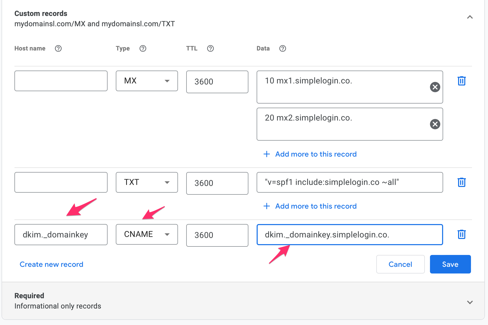

Use `dkim._domainkey` as "Host name", `dkim._domainkey.simplelogin.co.` as "Data".

Go back to SimpleLogin and click on "Verify", the DKIM should be now verified.

## (Optional) Add TXT record for DMARC

Once you have SPF and DKIM set up, setting up DMARC is recommended to even reduce further the chance your emails ending up in the recipient's Spam folder.

On Google Domains, click on "Create new record" button, then add the following TXT record:

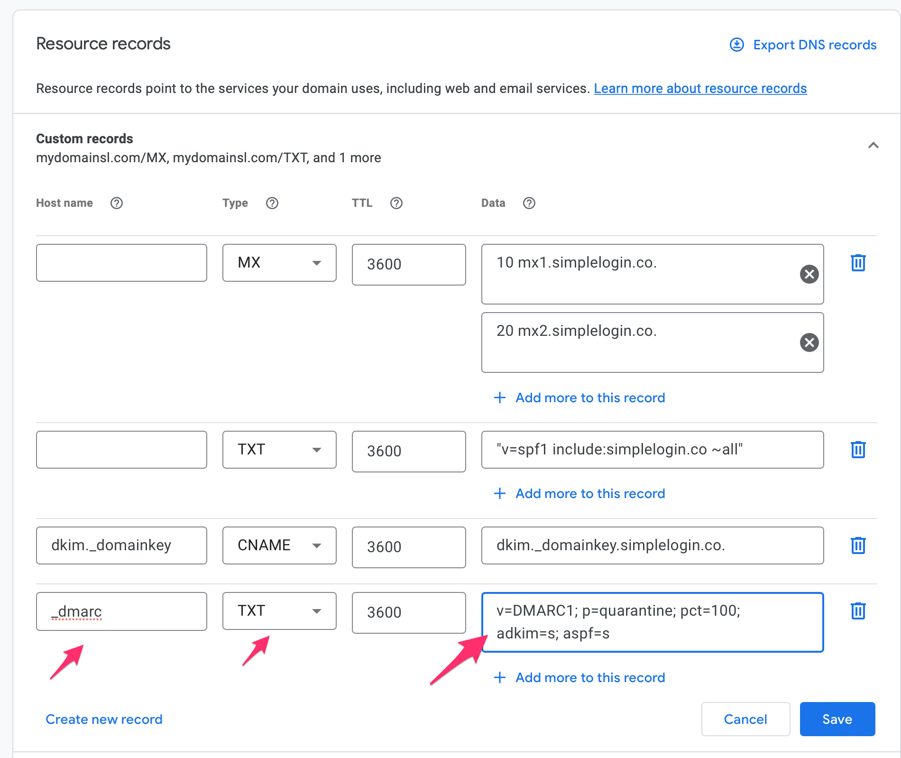

Use `_dmarc` as "Host name", `v=DMARC1; p=quarantine; pct=100; adkim=s; aspf=s` as "Data".

Go back to SimpleLogin and click on "Verify", the DMARC should be now verified.

