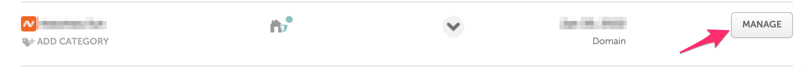
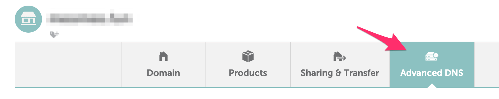
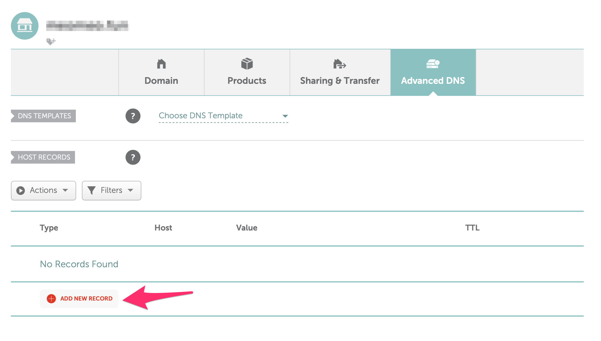
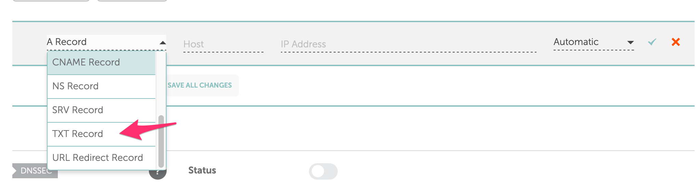
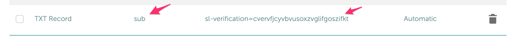
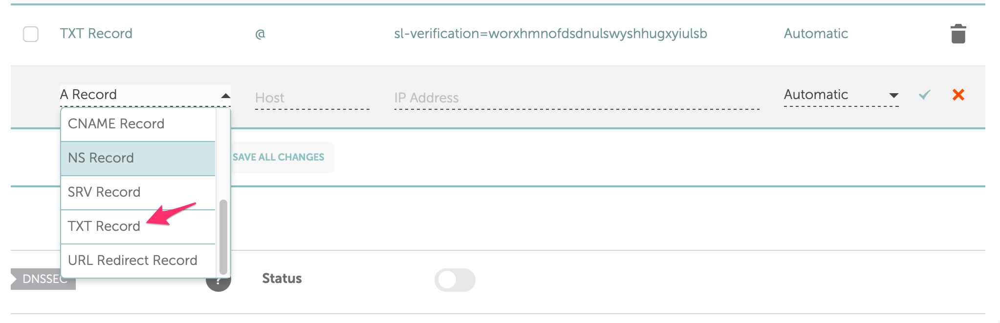
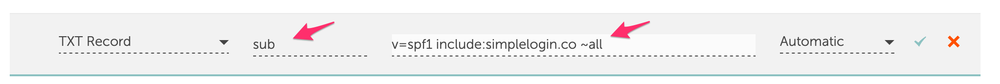
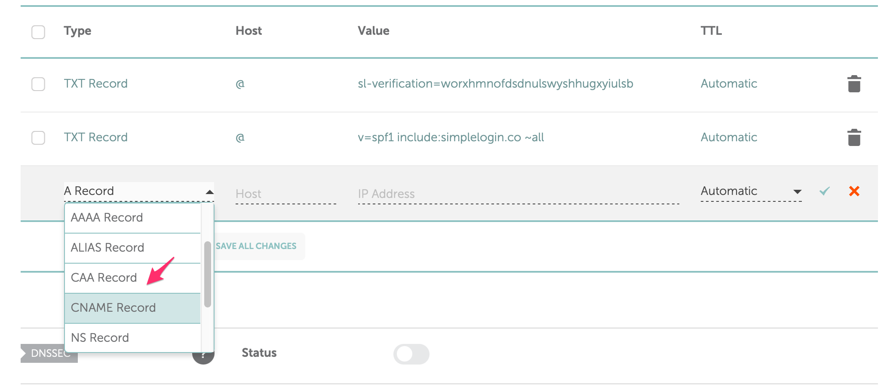
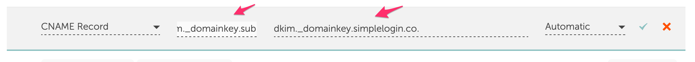
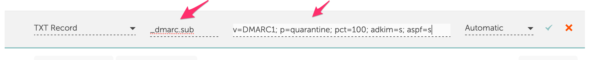

# How to add a NameCheap subdomain to SimpleLogin. 

In this page, we'll show how to add *sub.domain.com* into SimpleLogin. Please make sure to replace `sub.domain.com` by your actual subdomain.

Adding a NameCheap subdomain to SimpleLogin is similar to [adding a NameCheap domain](namecheap.md). The main diffrence is you need to replace `@` by `sub` for most DNS records.

## Add the subdomain to SimpleLogin 

Head to the SimpleLogin [domain page](https://app.simplelogin.io/dashboard/custom_domain) and add the subdomain:

You'll be redirected to SimpleLogin DNS page that has a guide to set up different DNS records for your domain.

## Add TXT record on NameCheap to verify your domain ownership

If your *root* domain (*domain.com*) is already added as SimpleLogin domain, this step isn't necessary.

Otherwise to verify your subdomain ownership, click on the "Manage" button on your NameCheap dashboard

Then click on "Advanced DNS" button

Click on "Add New Record" button under the "HOST RECORDS" section, then choose "TXT Record"

Use `sub` for "Host" field and the value required by SimpleLogin on the "Value" field. Don't forget to click on ✓ to save the change.

Now click on "Verify" on SimpleLogin, your domain ownership should be now verified. Please note that it can take up to several minutes for the DNS change to be available. In this case don't hesitate to click on "Verify" several minutes later.

Once your domain ownership is verified, you can continue with the rest of the setup.

## Add MX record on NameCheap

First choose "Custom MX" on under the Mail Settings.

Then click on the "Add new record" button.

Fill on the values as recommended on SimpleLogin domain page: `sub` for "Host", `mx1.simplelogin.co.` for "Value", `10` for Priority. Don't forget to click on ✓ to save the change.

Let's do the same step but this time replace `mx1.simplelogin.co.` by `mx2.simplelogin.co.` and use `20` as priority instead of `10`

If you have existing MX records for the subdomain, you need to remove them as well.

Now click on "Verify" on SimpleLogin, the MX records should be now verified. As it can take up to several minutes for the DNS change to be available, don't hesitate to click on "Verify" several minutes later.

Once the MX record is verified, you can start creating aliases with your domain! Click on "New Custom Alias", you should now see your domain in the list of available domains.

## (Optional) Add TXT record on NameCheap for SPF

Setting up SPF is recommended if you plan to send emails from your aliases. It'll reduce the chance your emails ending up in the recipient's Spam folder.

On NameCheap, click on "Add New Record" button, then choose "TXT Record"

Use `sub` as "Host", `v=spf1 include:simplelogin.co ~all` as "Value" and click on ✓ to save the change.

Go back to SimpleLogin and click on "Verify", the SPF should be now verified.

## (Optional) Add CNAME record on NameCheap for DKIM

Similar to SPF, setting up DKIM is recommended if you plan to send emails from your aliases. It'll reduce the chance your emails ending up in the recipient's Spam folder.

On NameCheap, click on "Add New Record" button, then choose "CNAME Record"

Use `dkim._domainkey.sub` as "Host", `dkim._domainkey.simplelogin.co.` as "Value" and click on ✓ to save the change.

Go back to SimpleLogin and click on "Verify", the DKIM should be now verified.

## (Optional) Add TXT record for DMARC

Once you have SPF and DKIM set up, setting up DMARC is recommended to even reduce further the chance your emails ending up in the recipient's Spam folder.

On NameCheap, click on "Add New Record" button, then choose "TXT Record"

Use `_dmarc.sub` as "Host", `v=DMARC1; p=quarantine; pct=100; adkim=s; aspf=s` as "Value" and click on ✓ to save the change.

Go back to SimpleLogin and click on "Verify", the DMARC should be now verified.

