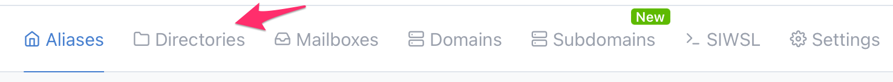
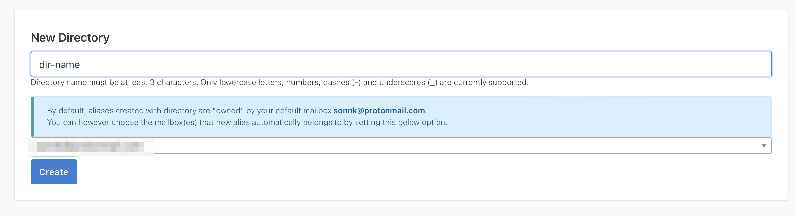
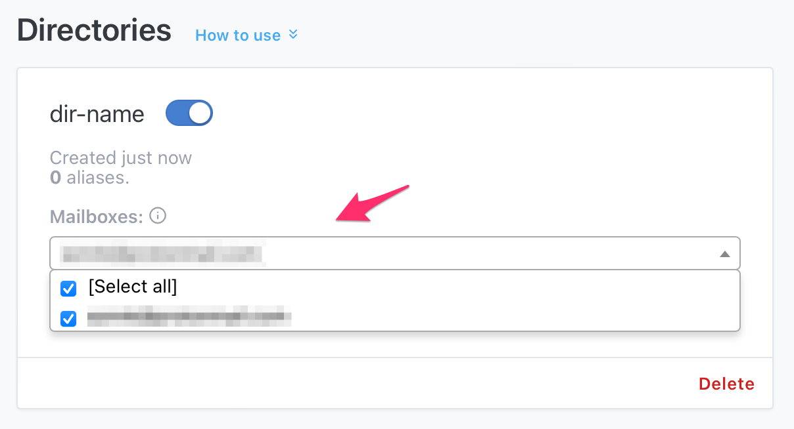

Having a directory allows you to quickly create aliases on the flight, i.e. you don't have to open SimpleLogin app to create a new alias.

For example, if you own the directory `dir-name`, you can make up an alias like `dir-name/mcdonald@aleeas.com` when you are commanding a McDonald burger without opening SimpleLogin app. Note the slash sign (`/`) in the address. You can also use dash sign (/) or plus sign (+) instead of /

To add a new directory, head to the Dashboard and click on the new "Directory" button on the menu:

You can then create a new directory, `dir-name` in this case:

Once created, you can start make up aliases like `dir-name/anything`@aleeas.com. `anything` can be replaced by, well, anything :).

By default a new alias created with your directory will forward emails to your default mailbox. You can change this to another mailbox or even select multiple mailboxes:

The directory feature is currently only available in the Premium plan.

