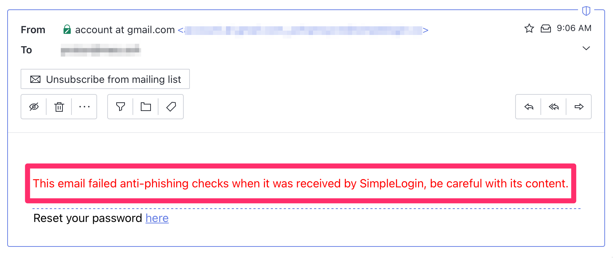
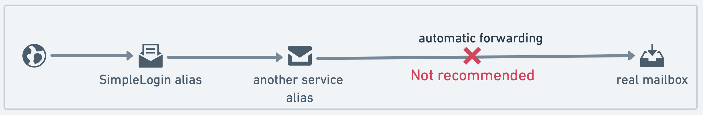
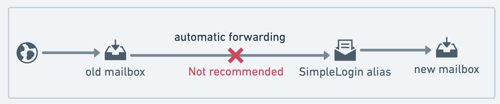

## SimpleLogin new anti-phishing feature

Most emails on Internet are spams and phishing attempts. To not forward unwanted and illegitimate emails, SimpleLogin automatically check the sender authenticity before forwarding the email to your mailbox.

The authentication check is currently based on [DMARC](https://en.wikipedia.org/wiki/DMARC), which is then based on [SPF](https://en.wikipedia.org/wiki/Sender_Policy_Framework) and [DKIM](https://en.wikipedia.org/wiki/DomainKeys_Identified_Mail), the two popular email authentication methods.

When the authentication check fails, depending on the policy set by the sender, an email can either:

- be put into **quarantine**. This happens when the sender explicitly states their emails should respect DMARC and any email that violates this should either be quarantined or rejected. In this case, SimpleLogin will inform you through email and send a [notification](https://app.simplelogin.io/dashboard/notifications), and you can download the quarantined email. Unfortunately, the only solution is the sender fixing their DMARC settings as their emails are probably being refused or put into Spam everywhere.

- have the following **warning added**. This happens when the authentication fails but the sender doesn’t set any specific action. The email can be a phishing attempt, and it’s important for SimpleLogin to inform you about the potential risk. Unfortunately, false positives do happen, especially when the sender incorrectly sets up their DMARC. It would be beneficial to inform the sender in this case, as their emails might end up in Spam everywhere.

## Email forwarding and DMARC

Email authentication fails when an email is forwarded in a “classic” way, i.e., automatic forwarding from one mailbox to another. When an email is forwarded, its sender isn't the original sender, and the IP address that sends the email is now the forwarder IP address.

SimpleLogin develops our own forwarding technique to respect email authentication. SimpleLogin forwarding isn't compatible with the old forwarding and mixing them will cause unwanted issues. 

We therefore recommend:

-	Not using a forwarding email address as a SimpleLogin mailbox. This includes using another service (Apple Hide My Email, DuckDuckGo email, Firefox Relay, etc.) alias as a mailbox in SimpleLogin. This will add additional forwarding steps in the email chain. As different email alias services aren't compatible, you won't also be able to reply to forwarded emails or send emails from an alias. 

-	Not auto-forwarding your old mailbox to a SimpleLogin alias. Some mailbox services rewrite the email headers when forwarding the email, which interferes with the SimpleLogin alias system. This setup is often used when you want to automatically forward emails received by an old mailbox to a new mailbox. We suggest just forwarding the emails to the new mailbox in this case, or if you don’t want the old mailbox to "know" about the new one, create an additional mailbox just for the purpose of forwarding the emails.

