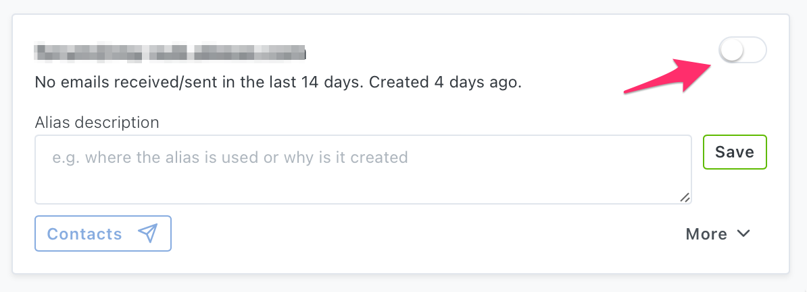
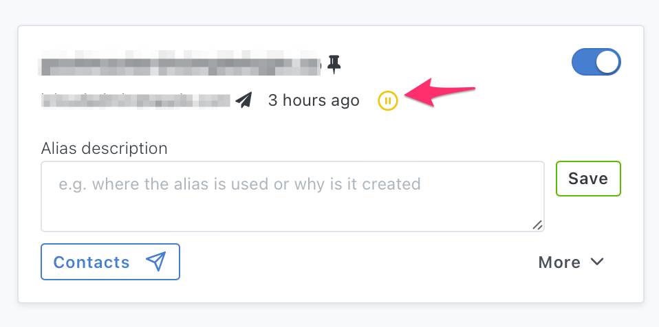
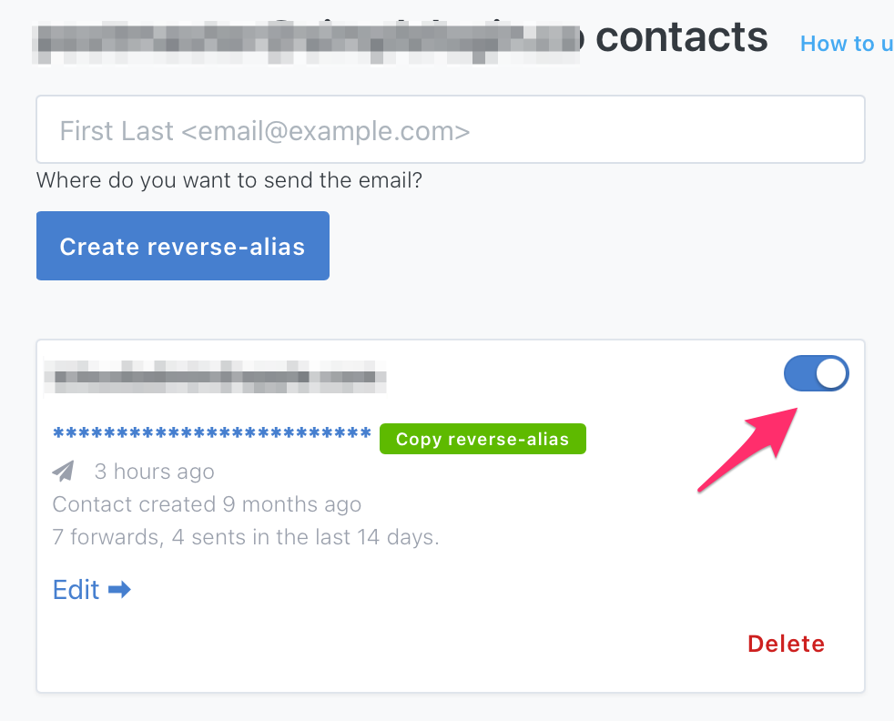

# Stop receiving emails sent to an alias

When you start to receive unwanted emails sent to an alias, you can either:

- disable the alias: emails sent to this alias will stop being forwarded to your mailbox. SimpleLogin will still accept the emails in this case but will discard them. This way, you can re-enable the alias if you want to receive emails sent to it again in the future.

- block the sender: this particular sender will be blocked but other people can still be able to reach your alias. This option is preferrable if your alias is public.

To disable an alias, simply disable the toggle on the alias on dashboard:

To block a sender, you can either block them directly on the dashboard:

Or go to a contact page and bloock them there

If your email client supports "one-click unsubscribe" feature, you can also quickly disable an alias or block an alias using this button. More info on [one-click unsubscribe](one-click-unsubscribe.md).