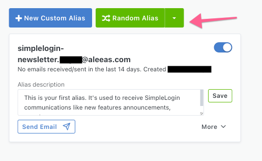
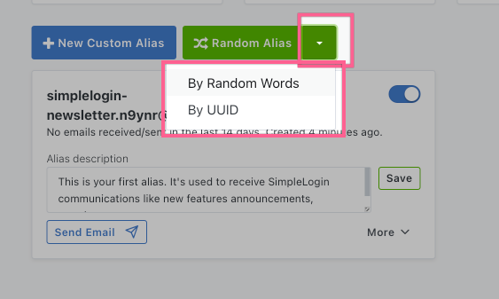
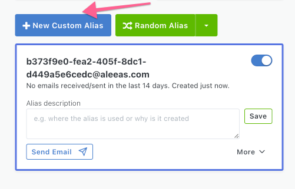
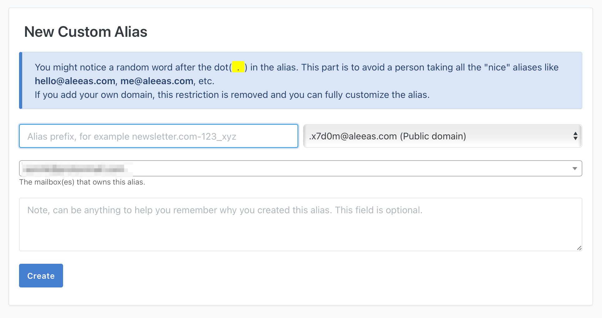

# Create your first alias

There are 2 kinds of aliases: *custom* alias and *random* alias.

*Custom* alias allows you to customize the alias address so you can for example put the website name in the alias to better remember it.

*Random* alias is a randomly generated alias.

## Create a random alias

To create a random alias, click on "Random Alias" button on the dashboard.

You can also click on the dropdown icon to either choose a random alias composed of random words or UUID. UUID stands for Universally unique identifier and an example of an UUID alias is b373f9e0-fea2-405f-8dc1-d449a5e6cedc@aleeas.com

## Create a custom alias

To create a custom alias, click on "New Custom Alias" button that'll bring you to the next screen.

On this screen, you can customize the left part of the alias address and optionally add a note (e.g. to remember where the alias is used)

