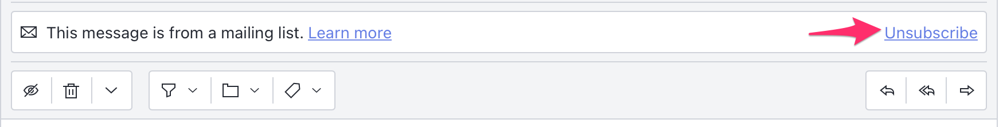
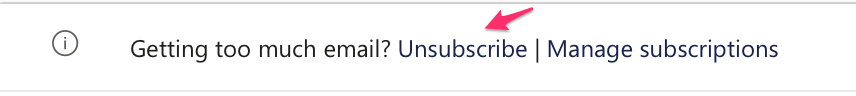
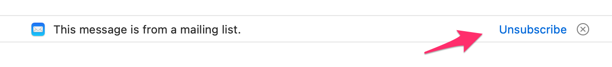
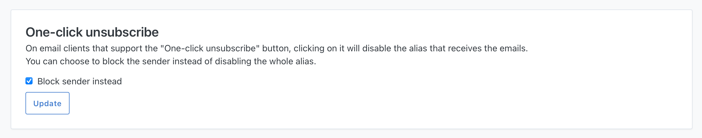

One-click unsubscribe (or [RFC8058](https://datatracker.ietf.org/doc/html/rfc8058)) is provided by some email clients that allow you to quickly unsubscribe from a sender.

Proton Mail example:

Outlook/Hotmail example:

MacOS Mail client example:

All forwarded emails from SimpleLogin provide this one-click unsubscribe button that allows you to stop receiving these emails by clicking on it, which will **disable the alias**. SimpleLogin will also send you a confirmation email.

You can also choose to block the sender instead of disabling the alias by using the [One-click unsubscribe setting](http://app.simplelogin.io/dashboard/setting#one-click-unsubscribe-section); this way, only the sender is blocked but the alias is still active and receives emails from other senders. 

