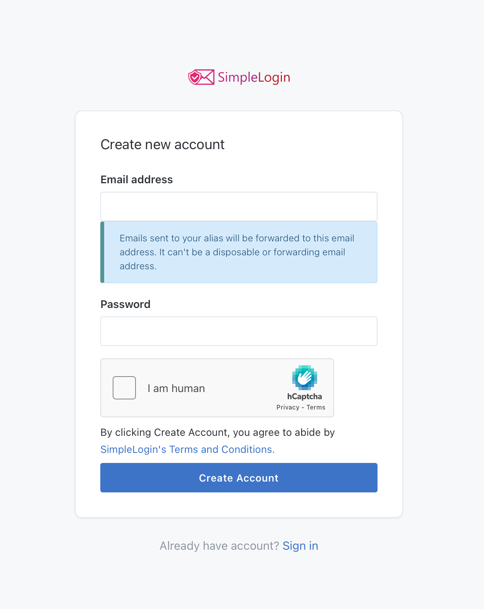
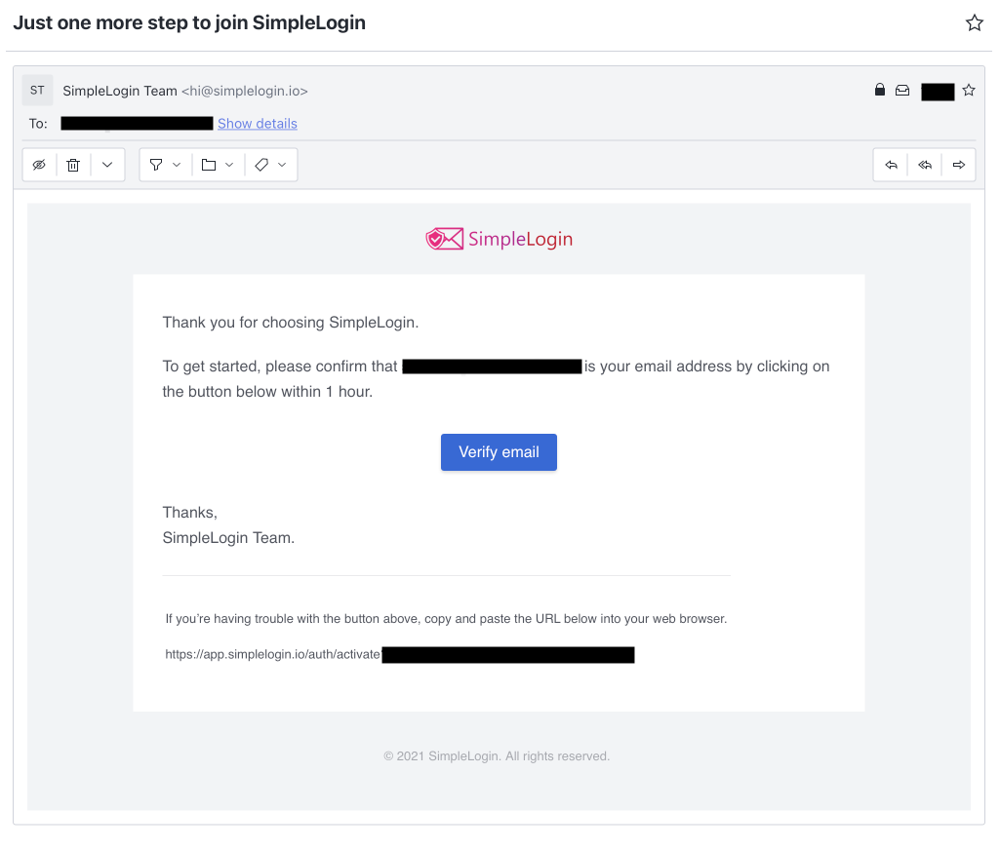

# Register for an account

To use SimpleLogin, you need to register an account.

To explore all Premium features, we offer you a free 7-day trial. Apart from the limit of 10 aliases, there are no restrictions on your usage during the free trial. No credit card is required to sign up for the trial either. 

After the trial, if you decide to not upgrade, your account will be in the Free plan. All aliases created during the trial are kept and continue to work normally, except from the PGP encryption which is only available in the Premium plan.

## Register your account

Fill in your email address, choose your account password and click on the "Create Account" button.

## Verify your email address

We'll send you an email to verify your email address. Look for an email with the subject line "Just one more step to join SimpleLogin".

Please click on the "Verify Email" button that we sent to you via email to activate your SimpleLogin account.

Don't see this email in your inbox? Please check your spam folder and contact support@simplelogin.zendesk.com if the problem persists.

## Sign up with Proton

If you have a Proton account, you can quickly sign up in SimpleLogin using the "Sign up with Proton" button. A new SimpleLogin will be created using your Proton address.

If you have an Unlimited, Business and Visionary plan in Proton, your SimpleLogin account will be automatically upgraded.

