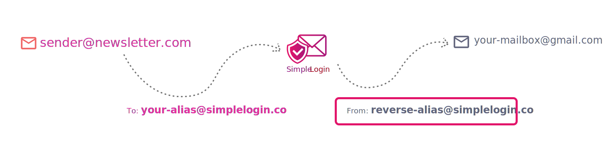
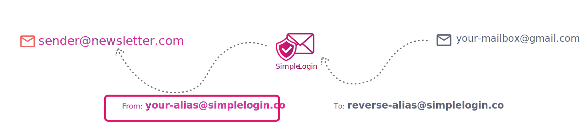
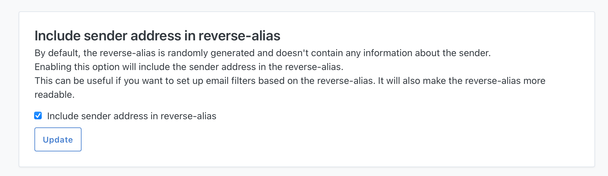

# Reverse alias

When a sender sends an email to your alias, SimpleLogin forwards the email to your mailbox from a special address called **reverse-alias**. 

The reverse-alias allows you to reply to the forwarded email: when you reply to the email, you are actually replying to the reverse-alias. SimpleLogin will then send the email from your alias and your real mailbox address stays hidden.

Similarly when you want to send an email from your alias to a contact who hasn't yet sent you an email, you can create a reverse-alias for this contact. You can read more about how to send an email from your alias on [this page](send-email.md).

A reverse-alias is unique for each sender and alias. By default it's composed of random characters (e.g. `abcdef123456@simplelogin.co`) but you can choose to include the sender address in the reverse-alias using the "Include sender address in reverse-alias" setting on the [Settings page](https://app.simplelogin.io/dashboard/setting)

