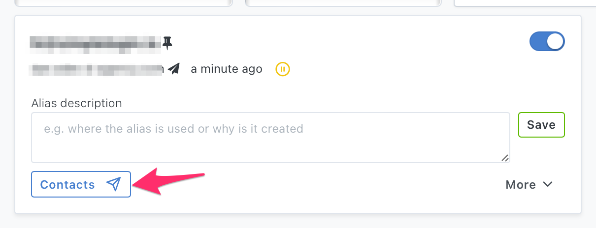
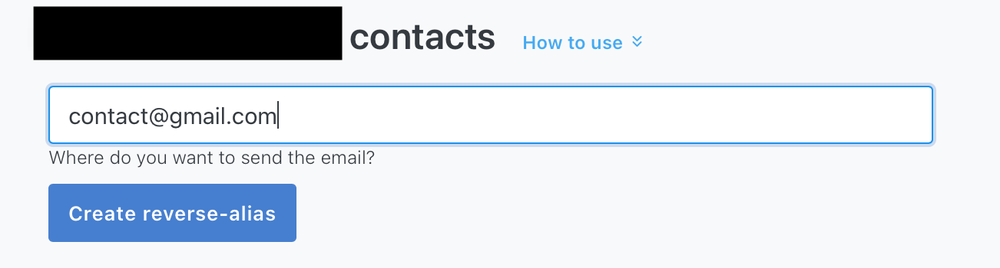
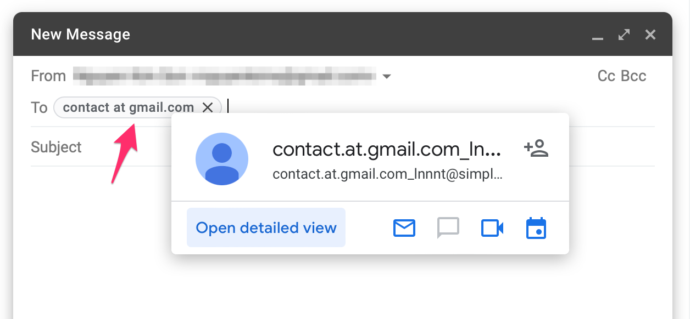

# How to send emails from your alias

If you want to reply to an email, just hit "Reply" and the response will come from your alias. Your personal email address stays hidden.

To send an email to a new contact, please follow the steps below. You can also watch this Youtube video that quickly walks you through the steps.

1) Click the "Contacts" button on the alias you want to send emails from

2) Enter your contact email, this will create a **reverse-alias** for the contact. 

3) Send the email to this reverse-alias instead of the contact email.

And voilà, your contact will receive this email sent from your alias! Your real mailbox address will stay hidden.

