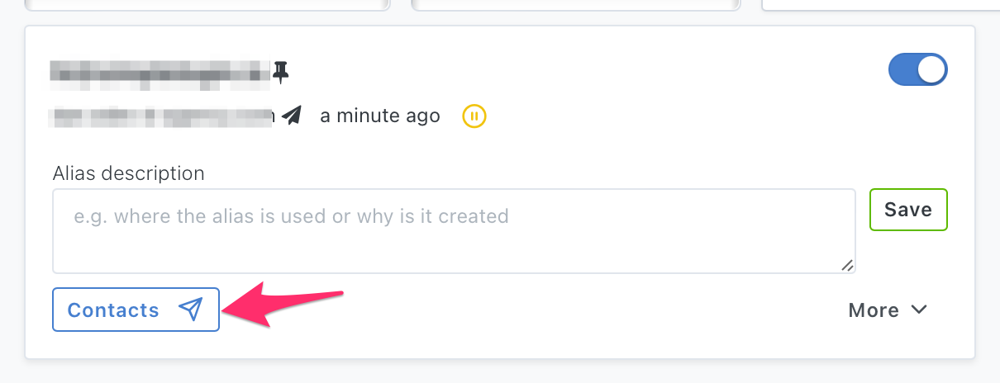
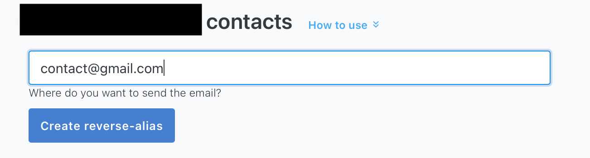
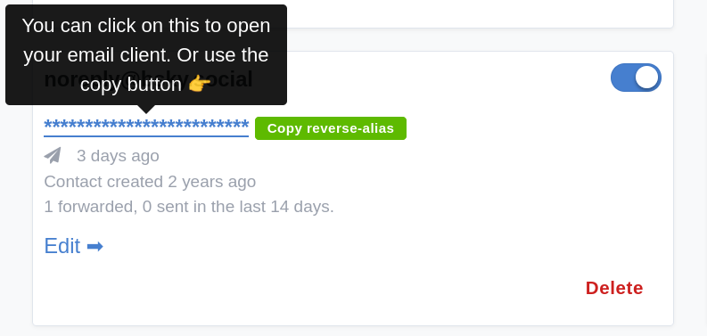
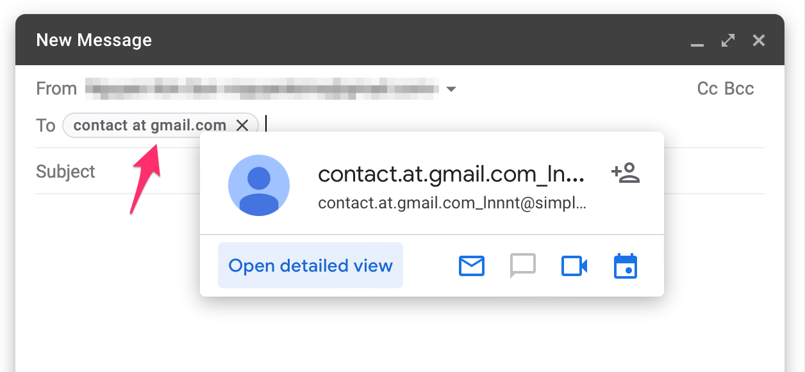

# How to send emails from your alias

If you want to reply to an email, just hit "Reply" and the response will come from your alias. Your personal email address stays hidden.

To send an email to a new contact, or start a conversation with someone who is in contact with your alias, please follow the steps below. You can also watch this YouTube video for a quick walkthrough. Please note that this feature is available only with a paid plan (e.g., SimpleLogin Premium, Proton Pass Plus, and higher).

1) Click the "Contacts" button on the alias you want to send emails from

2) Enter your contact email, this will create a **reverse-alias** for the contact. 

3) If SimpleLogin already picked up the alias because you have already received an email from them; copy the "Send To" alias address by clicking "Contacts" in step 1. Then the "Copy reverse-alias" button for any given contact. Do not lose this address as anyone will be able to send from your alias address.

4) Send the email to this reverse-alias instead of the contact email.

And voilà, your contact will receive this email sent from your alias! Your real mailbox address will stay hidden.

