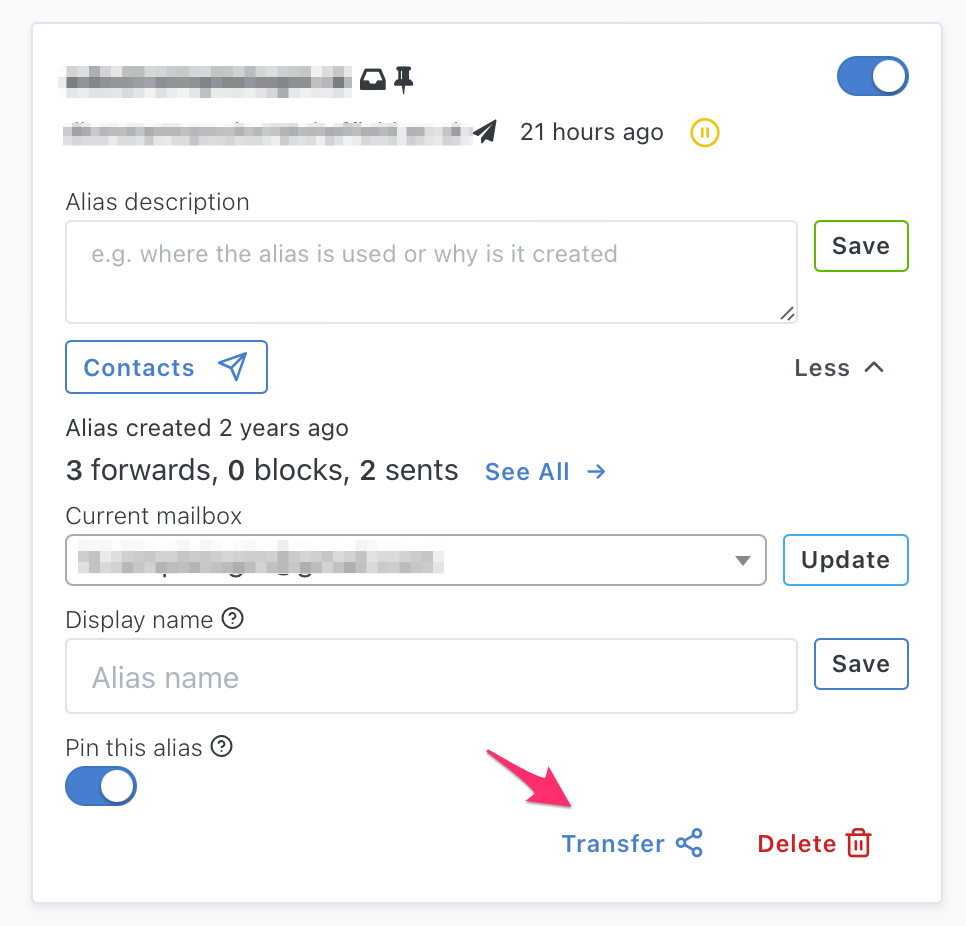
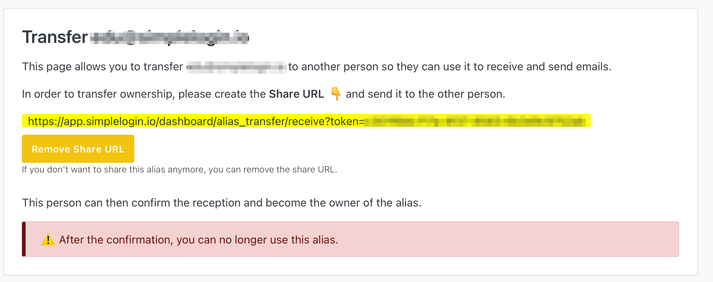

You can transfer an alias to another SimpleLogin account by clicking on the "Transfer" button:

You can then generate a share URL that allows the other person to receive the alias.

Please note that once the alias is received by the other person, you can no longer use the alias. If you change your mind in the meantime, you can always remove the share URL.
