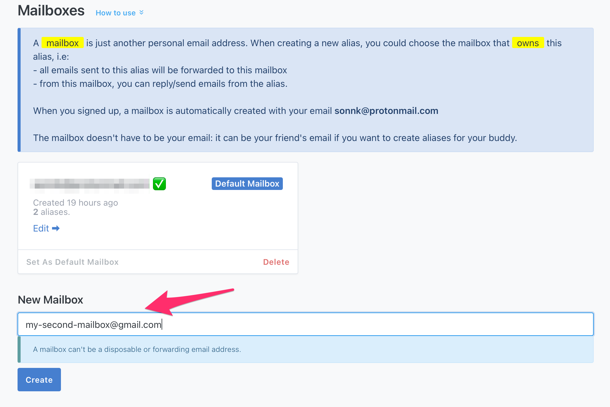
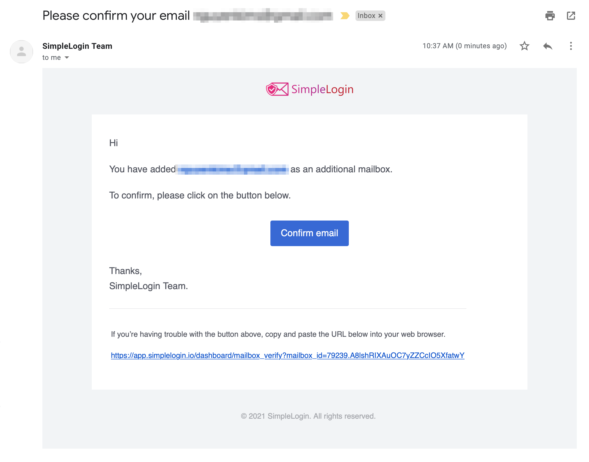
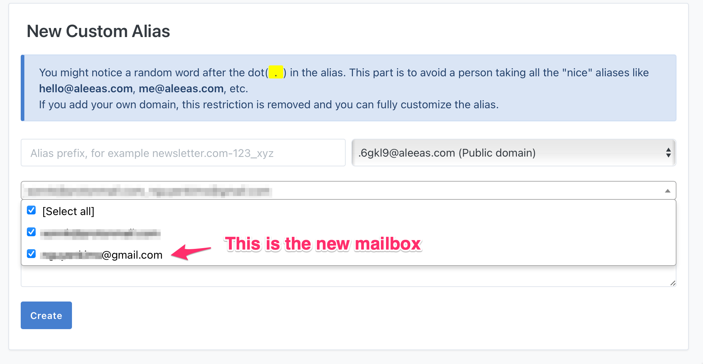
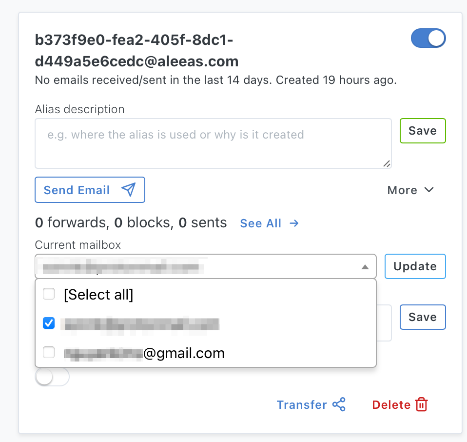

*Mailbox* is where emails sent to an alias are forwarded to. It's your usual mailbox, e.g. Gmail, Outlook, Proton Mail, etc.

When you sign up for a SimpleLogin account, the email address you provided is used to create a default mailbox.

You can add additional mailboxes and use them to manage your aliases. When creating a new alias, you can choose multiple mailboxes as its *owner*, meaning an email sent to this alias will be forwarded to all these mailboxes. You can then use these mailboxes to reply to a forwarded email or send emails from this alias.

To add a new mailbox, head to the [mailbox page](https://app.simplelogin.io/dashboard/mailbox)

After that a verification email is sent the new mailbox. Look for an email with the subject line "Please confirm your email".

Please click on the "Confirm email" to activate your new mailbox.

Don't see this email in your inbox? Please check your spam folder and contact support@simplelogin.zendesk.com if the problem persists.

Once  the new mailbox is confirmed, you can use it when creating a new alias on the [custom alias page](https://app.simplelogin.io/dashboard/custom_alias)

You can also change an existing alias's mailboxes on the [dashboard](https://app.simplelogin.io/dashboard/)

