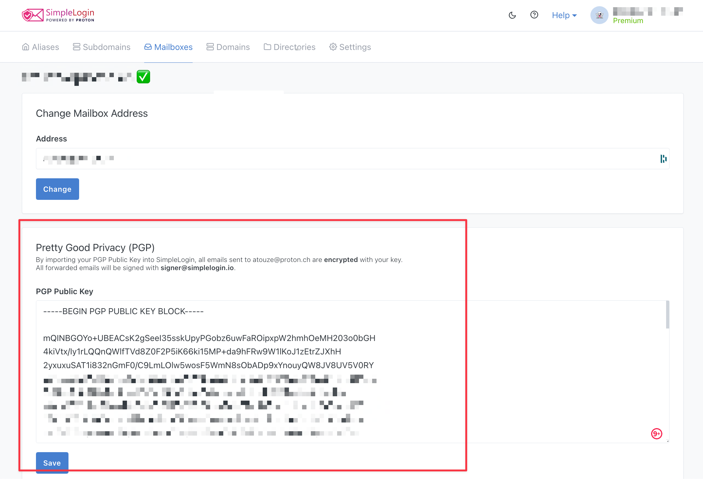

# PGP encryption on SimpleLogin

PGP encryption is **only available in premium plan**.

If your mailbox is hosted by email providers such as **Gmail, Outlook, Hotmail or YahooMail**, you might want to **encrypt your emails with PGP** in order to make sure that only you are able to read your emails.

## **If you are using ProtonMail**

**You don’t need to set up PGP**, if your mailbox is a ProtonMail email address.

ProtonMail already encrypts all emails with the public PGP key of your ProtonMail account and store your emails with **[zero-access encryption](https://proton.me/blog/zero-access-encryption)**.

## **If your mailbox does not support PGP encryption (Gmail, Hotmail, YahooMail etc.)**

In order to prevent Gmail, Hotmail, Yahoo from reading your emails, you need to add your public PGP key to your mailbox on SimpleLogin.

To do that, you need to create a PGP key pair. **You will only need to add you public PGP key to SimpleLogin**.

**Important!** SimpleLogin does not require or store your PGP Private key.

### **Add your public PGP key to your mailbox**

1. From your dashboard, go to **[Mailboxes](https://app.simplelogin.io/dashboard/mailbox)**
2. Click on the mailbox you would like to add your public PGP key to, and click **Edit →**
3. **Enable “Pretty Good Privacy (PGP)”** and copy/paste your public PGP key
4. Click **Save**

That’s it! From now on, all emails forwarded by SimpleLogin alias will be encrypted with your key.

To decrypt your emails using your PGP private key, you will need a **third-party software or extension**. A list of PGP supported softwares can be found on [OpenPGP.org](https://www.openpgp.org/software/).

### **(Optional) Hide email subject when PGP is enabled**

As PGP does not encrypt the email subject and the email subject might contain sensitive information, this option will allow a further protection of your email content.

By default, SimpleLogin replace the email subject as **“Encrypted Email”** but you can also customize this option.