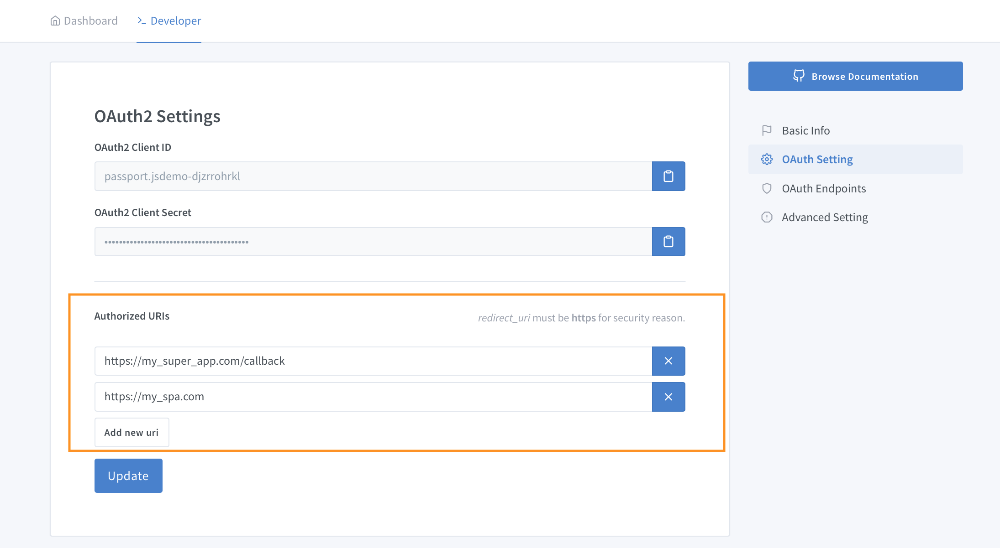

# SimpleLogin App

A SimpleLogin App represents an **user database**. For ex, if you have iOS, Android and Web app for a single product, then you just need a single SimpleLogin App. Same applies if you have 2 different products but that share the same user database.

## Create an App

Please head to [https://app.simplelogin.io/developer/](https://app.simplelogin.io/developer/) and click on **Create new app** to create a new app. You only need to provide a name.

All app fields are optional. We recommend however to provide as much information as possible so user can recognize your app. Teaser: a **showcase** feature is in progress and once the feature is ready, you can submit your app to the showcase to promote it to all SimpleLogin users.

Depending on the flow you choose (`code` or `implicit`), you would need store either:

- both `oauth client id` and `oauth client secret` if you decide to use `code flow`

- or just `oauth client id` if you choose `implicit flow`

To have a shorter terminology, `AppID` and `oauth client id` are the same thing and so are `AppSecret` and `oauth client secret`.

## App Redirect URI

This is the most important field in your app! By default SimpleLogin **whitelists** all `http[s]://localhost:*` address to facilitate local development but you need to set your app `Redirect URI` before deploying your app to production: in effect, SimpleLogin will refuse to present the **Authorization Page** to user if it doesn't recognize the `redirect_uri` passed in the `url`. You can add as many `redirect uri` as you want. Please note that except the localhost ones, the `Redirect URI` needs to be **https** for security reason.

When some errors happen during the authorization flow, SimpleLogin redirects user back to `redirect_uri?error={error_code}` so your app can act accordingly. Please find the list of all errors on [Error Codes](../errors).

## Libraries/Framework

SimpleLogin has added support for SimpleLogin in the following popular libraries and more are coming:

- Vanilla JS (`Implicit Flow`): [hello.js](https://github.com/MrSwitch/hello.js), [JSO](https://github.com/andreassolberg/jso)
- Python (Flask and other non-Django frameworks): [Requests-OAuthlib](https://github.com/requests/requests-oauthlib)
- Django: [social-auth-app-django](https://github.com/python-social-auth/social-app-django)
- NodeJS [Passport](https://github.com/jaredhanson/passport)

It's impossible to cover all Social Login libraries for all languages. As SimpleLogin implements fully OAuth2/OpenID Connect standard, any library compatible with these standards should be able to handle SimpleLogin with the following OAuth2/OpenID Connect endpoints:

- Authorization endpoint: https://app.simplelogin.io/oauth2/authorize
- Token endpoint: https://app.simplelogin.io/oauth2/token
- UserInfo endpoint: https://app.simplelogin.io/oauth2/userinfo

Please find in the **Guides** section dedicated guide for some frameworks/languages.

If you don’t want to use a library that supports OAuth/OpenID Connect, this can work too! Please head to

- [Code Flow - The raw way](../code-flow) for implementing the `Code Flow`
- [Implicit Flow - The raw way](../implicit-flow)  for implementing the `Implicit Flow`

