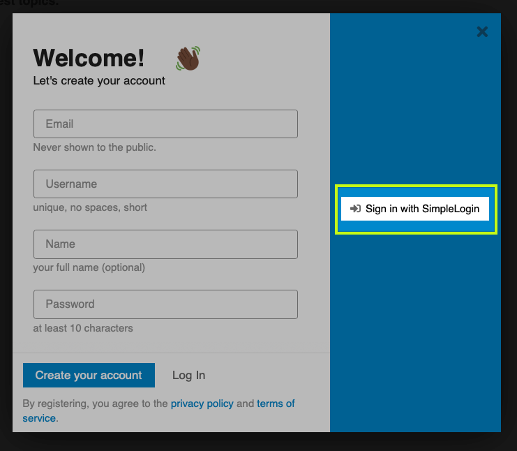
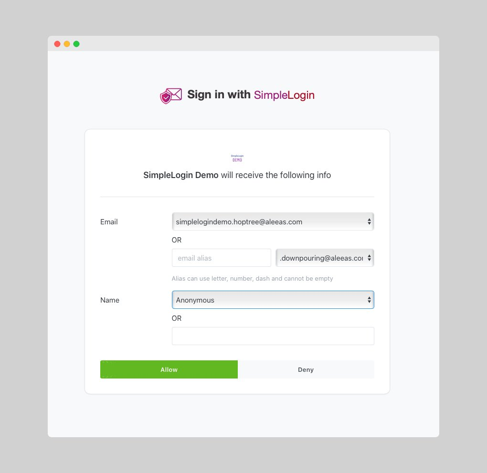
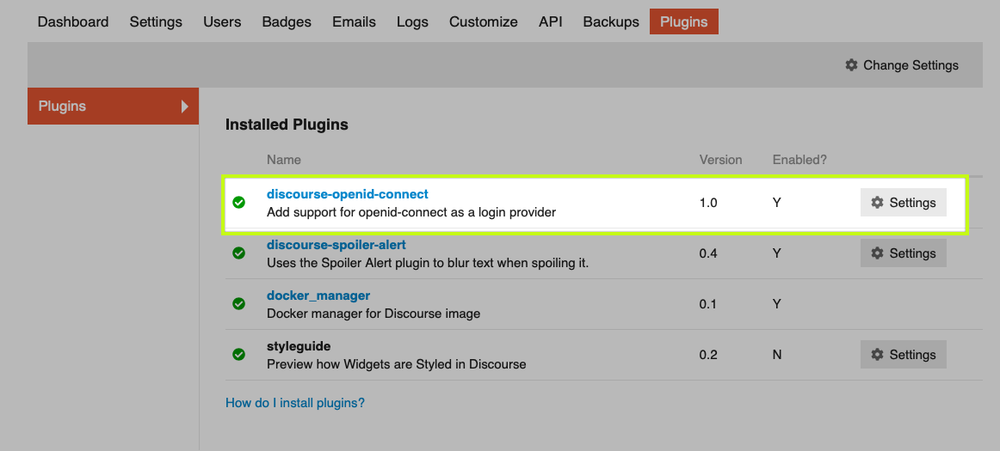
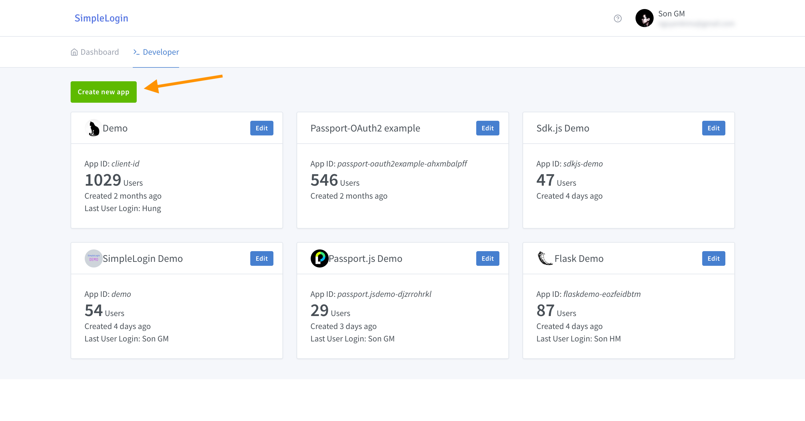
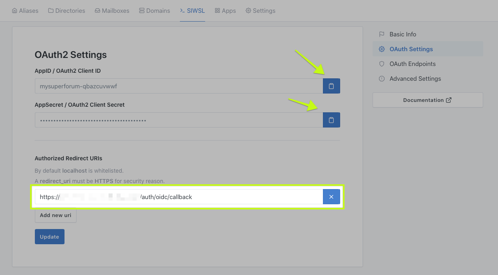
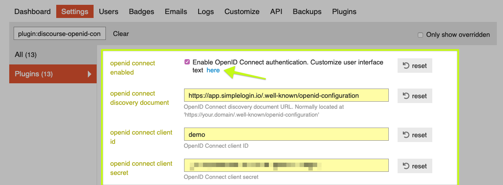
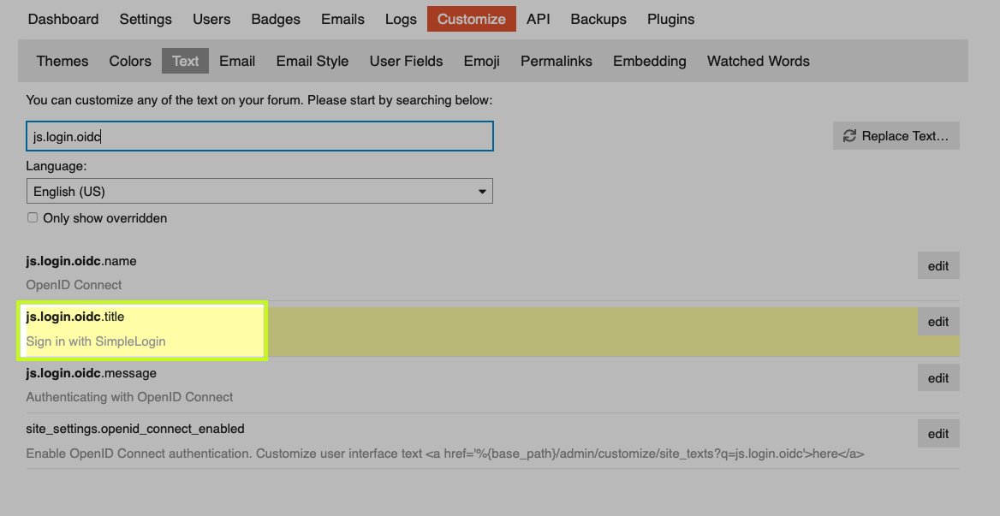

# Add SIWSL (Sign in with SimpleLogin) to Discourse
---

[Discourse](https://www.discourse.org) is a popular open-source forum software.

After adding SIWSL to Discourse, a person can choose to use their SimpleLogin account to log in or sign up on your forum 👇



and they can control which information they want to share:



Adding SIWSL is done in 3 simple steps.

## Step 1: Install the OpenID Connect Authentication Plugin

First, let's install the official OpenID Connect Authentication plugin by adding this line

```
sudo -E -u discourse git clone https://github.com/discourse/discourse-openid-connect.git
```

into your container’s `app.yml` file (usually present in `/var/discourse/containers/`). More info on how to install a plugin on [How to Install Plugins in Discourse](https://meta.discourse.org/t/install-plugins-in-discourse/19157)

```
hooks:
  after_code:
    - exec:
        cd: $home/plugins
        cmd:
          - sudo -E -u discourse git clone https://github.com/discourse/docker_manager.git
          - sudo -E -u discourse git clone https://github.com/discourse/discourse-openid-connect.git
```

After that rebuild the container.

```bash
cd /var/discourse
./launcher rebuild app
```

The plugin should be now available on the Discourse Admin/Plugins page



---

## Step 2: Create a website on SimpleLogin dashboard

Head to [SimpleLogin dashboard](https://app.simplelogin.io/developer/) and create a new website.



Now go to the **OAuth2 endpoints** page:

- Note the **Client ID** and **Client Secret** needed for the next step.

- Add `{your forum url}/auth/oidc/callback` as **redirect_uri**, make sure to replace `{your forum url}` by your actual forum URL.




---

## Step 3: Config Discourse OpenID Connect Authentication Plugin

Go to the Discourse admin page for Discourse OpenID Connect Authentication Plugin


then make sure to

- enable OpenID Connect
- copy https://app.simplelogin.io/.well-known/openid-configuration in **openid connect discovery document**
- copy your **Client ID** in step 2 to **openid connect client id**
- Copy your **Client Secret** in step 2 to **openid connect client secret**



Lastly, modify the plugin title to "Sign in with SimpleLogin" by editing the text (pointed by the arrow 👆)



## Enjoy!

Now SIWSL should be provided as a login/register option on your forum. Your community members now have a choice of using a privacy-focused, open-source login solution 🎉.


