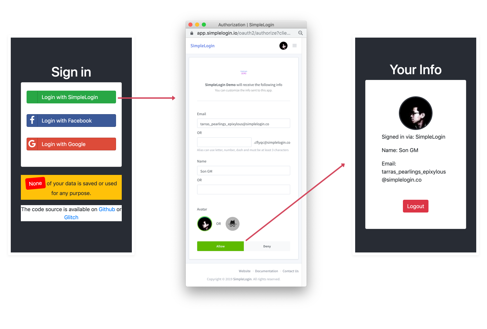

# SIWSL (Sign in with SimpleLogin)

SIWSL is an [open-source](https://github.com/simple-login/app) privacy-focused login service.

Integrating SIWSL gives your users total control over what information they share when they sign up for your website.


Instead of the confusing and over-complex experiences of **Login with Google/Facebook** docs, SIWSL is created by developers for developers and as such, is simple and easy to integrate.

## Quick Start

The easiest way to try out SIWSL is via SimpleLogin JS SDK.

### Step 1: Create a `index.html` file

that has a **Sign in with SimpleLogin** button

```html
<button id="btn-simplelogin">
    Sign in with SimpleLogin
</button>

<div id="user-info"></div>

<!-- Include SimpleLogin JS SDK -->
<script src="https://simplelogin.io/sdk/sdk.js"></script>

<script>
// Init SimpleLogin. "quickstart" is the SimpleLogin AppID
SL.init("quickstart");

// Call SL.login when user clicks on the login button
// Upon successful login, you will have access to the user information
document.getElementById("btn-simplelogin").onclick = function(e) {
  SL.login(function(user) {
    console.log("got user from SL SDK", user);

    document.getElementById("user-info").innerHTML = `
    email: ${user.email} <br>
    name: ${user.name} <br>
    avatar: 
    `
  })
}
</script>
```

### Step 2: Run a local web server

You can use any static server, for example Python `http.server` module:

> python3 -m http.server

or NodeJS `http-server` module

> npx http-server -p 8000

Now you should be able to sign in with SimpleLogin on [http://localhost:8000](http://localhost:8000) 🎉

---

## User Info

SIWSL allows you to obtain the following information from a person:

- `email`: either their personal email address or an email alias.

- `name`: their name.

- `avatar_url` (optional): only if this person has decided to share their profile picture. This url is **expired** in 1 week.

The next section quickly introduces OAuth2 and what `flow` should be used. If you already have a strong understanding of `OAuth2`, please head directly to [App](../app)

## Overview

The user's login experience consists of 2 steps:

1. User clicks on **Sign in with SimpleLogin** button and gets redirected to the SimpleLogin authorization page. User will be asked if they want to share their information with your app/website.

2. User accepts, gets redirected back to your application and is authenticated.



## Flow

From your app's point of view, the flow is the following:

1. User clicks on **Sign in with SimpleLogin** and your app generates a redirection url to SimpleLogin that contains information about your website/app, e.g. `https://app.simplelogin.io/oauth2/authorize?client_id={AppID}&redirect_uri={your_callback_url}`
where `{AppID}` is your SimpleLogin AppId and `{your_callback_url}` is the url that user will be redirected back to in the next step.

2. User approves sharing data with your app, gets redirected back with `{your_callback_url}` along with a special `grant` that allows you to get user information. At this point there are 2 possibilities:

   * the `grant` is an `access token`, in this case it's the `implicit flow`: you can use `access token` to call `user info endpoint` at https://app.simplelogin.io/oauth2/user_info and gets the user info.
   * the `grant` is a `code`, in this case it's the `code flow`: you need an additional step to get the `access token` by calling the `token endpoint` at https://app.simplelogin.io/oauth2/token using `code`. The next step is the same as the previous case where you can get user info using the `access token`.

## Code Flow

If you have access to your back-end (Php, Python, etc), we recommend using `Code Flow` which is more secure: the `code` is transferred using browser redirection but the `access token` is exchanged in a backend-to-backend call.

The url that the user is redirected to after the first step would be `{your_callback_url}?code={code}`

## Implicit Flow

If you don't have access to your back-end or it is difficult to modify back-end code, you should use the `Implicit Flow` where  the `access token` is sent via browser redirection.

The url that the user is redirected to after the first step would be `{your_callback_url}#access_token={access_token}`. Please note that here `#` (fragment) is used instead of `?` (query) to avoid the `access token` from hitting your back-end which should have nothing to do with it.

Please note that the `implicit flow` will probably be replaced soon by the [PKCE](https://tools.ietf.org/html/draft-ietf-oauth-security-topics-11#section-2.1.1). Support for `PKCE` is on the SimpleLogin roadmap. Its use will be transparent in SimpleLogin SDK, meaning that you don't need to change anything.

## Standing on the shoulders of giants

SimpleLogin follows the protocols OAuth2 and OpenID Connect, the same standards that power Facebook/Google/Apple/etc login. SimpleLogin is therefore compatible with almost all libraries that support these protocols. The integration consists most of the time of putting the right endpoints 😉

Now please head directly to [App](../app) to create your first SimpleLogin App!


