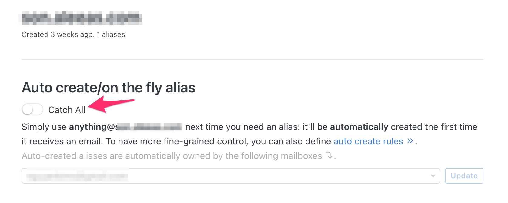
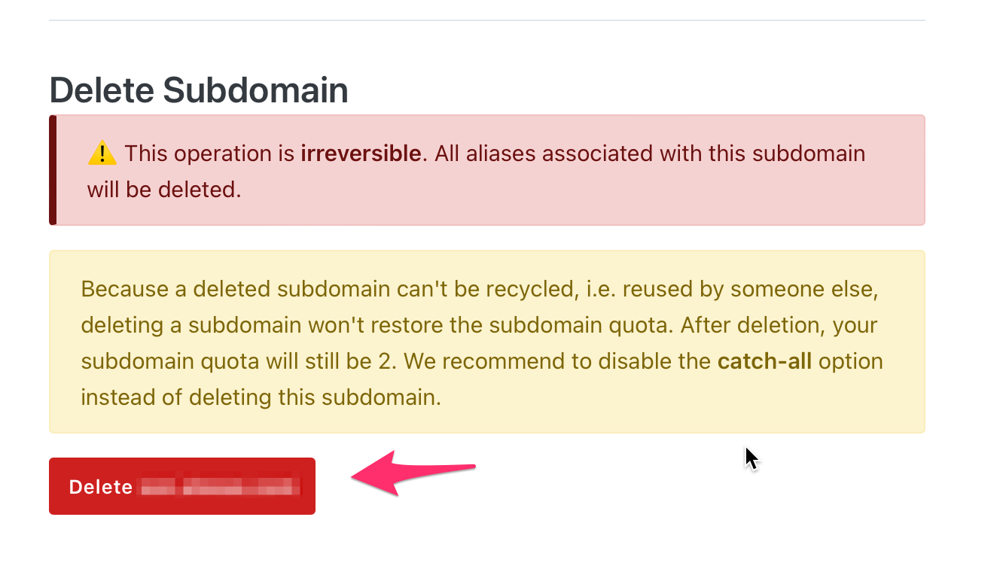

Similar to a deleted alias, a deleted subdomain can't be reused by someone else. Otherwise they might receive emails that they aren't supposed to.

For that reason, deleting a subdomain doesn't increase your subdomain quota.

Instead of deleting a subdomain, we suggest to disable the *catch-all* option instead.

You can however choose to delete a subdomain. All aliases belonging to this subdomain will also be deleted.

