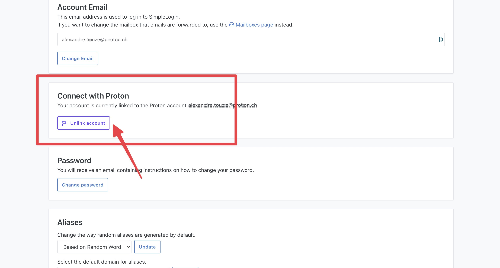
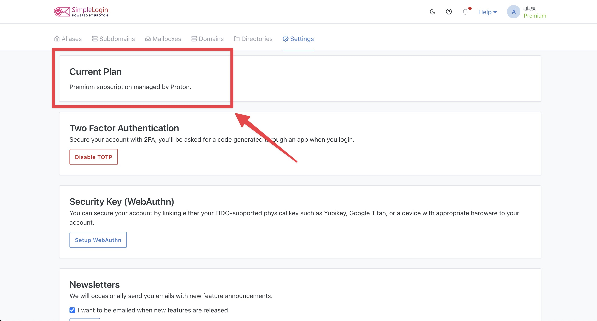
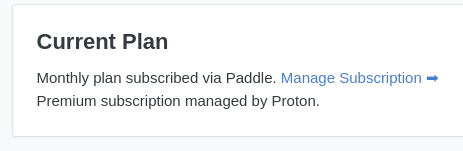
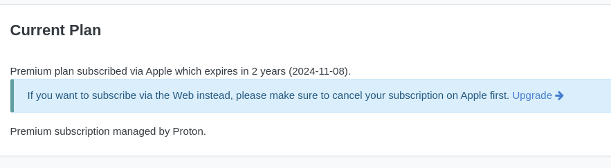

# Switching from a SimpleLogin subscription to Proton Unlimited

On July 2022, [SimpleLogin announced the “Login with Proton” feature](https://twitter.com/SimpleLogin/status/1552254729148825600?s=20&t=cPBDO4sj71R86r9Nzu4H1A), allowing you to quickly create a new SimpleLogin account or to connect your existing SimpleLogin account using Proton SSO.

If you have a **Proton Unlimited, Business, or Visionary (legacy)** subscription, you can benefit from all **SimpleLogin premium** features for free as it is now included in your Proton plan.

That may result in 2 subscriptions if you already had a SimpleLogin subscription.

This article helps you to **1) connect your Proton** and SimpleLogin account  and **2) Cancel your current SimpleLogin subscription** to avoid being charged again during the renewal.

Before starting, make sure you have:

**a)** an active Proton Unlimited, Proton for Business, or Proton Visionary (legacy) plan.

**b)** an active, renewable SimpleLogin subscription. This includes subscriptions with credit card or PayPal (via our partner Paddle) or via Apple in-app purchase. Subscriptions with cryptocurrency (via Coinbase) or via coupon codes aren’t concerned.

### **1. Connect your Proton to your SimpleLogin account**

1. Log in to your SimpleLogin account and go to [Settings > Connect with Proton](https://app.simplelogin.io/dashboard/setting#connect-with-proton)
2. Click **Link account**

This will open a window to connect to your Proton account. Once connected, you will be automatically redirected to SimpleLogin. 

After that, you should **“Premium subscription managed by Proton”** at the top of the Settings page. Please note that the connection can sometimes take up to several minutes.

For more details about the Proton/SimpleLogin integration, please refer to Proton’s documentation on [How to connect an existing SimpleLogin account to a Proton Account](https://proton.me/support/link-simplelogin-account-proton-account).

### **2. Cancel your old SimpleLogin subscription**

Once you have connected your Proton account with a Proton Unlimited, Proton for Business, or Proton Visionary (legacy) plan, you may proceed and cancel your current SimpleLogin subscription.

Please note that SimpleLogin premium benefits are active as long as your Proton subscription is active. If your Proton subscription is canceled or expired, SimpleLogin premium benefits will cease immediately.

1. Connect to your SimpleLogin account
2. Go to **Settings**, stay at the top of the page at the **“Current plan”** section

**a. If you subscribed via Web or Android**

You should see something like this:

Click on **“Manage Subscription →”,** a popup should appear for you to cancel your subscription.

 

Your original SimpleLogin subscription will not be renewed, no further payment will proceed, and you will still benefit from all SimpleLogin’s premium feature thanks to your Proton Unlimited license.

**b. If you subscribed via Apple iOS**

You should see something like this:

If you subscribed via iOS, you can [cancel your subscription from your Apple ID account](https://support.apple.com/guide/ipad/manage-purchases-subscriptions-settings-ipadee10c6e7/ipados).

Your original SimpleLogin subscription will not be renewed, no further payment will proceed, and you will still benefit from all SimpleLogin’s premium feature as long as your Proton subscription is active.

### **Frequently Asked Questions**

#### **Are the benefits from Proton premium equivalent to SimpleLogin premium?**

*Absolutely, you will have access to the exact set of premium features on SimpleLogin.*

#### **Is there a risk of losing my aliases when switching between my SimpleLogin subscription and my Proton Plan?**

*No, all your alias will be kept even if your SimpleLogin Premium subscription is briefly stopped. You will just not be able to create new aliases.*

*If you need any help, feel free to [contact our customer support by creating a request ticket](https://app.simplelogin.io/dashboard/support).*

#### **What I subscribed to a SimpleLogin annual plan? Can I be reimbursed?** 

*Unfortunately, we can not offer a refund for previously paid subscription.*